# V2

1. V2 版本与V1版本不兼容.v2版本从配置文件可读性，代码复用解耦等方面进行了优化。
2. 添加了多标签文本分类。

## features
- [x] 评价指标tensorboard可视化
- [x] 网络结构tensorboard 可视化
- [x] 弃用json配置文件的方式（不可添加注释），改用可读性更好的yml配置文件格式。
- [x] 兼容[huggingface/transformers](https://github.com/huggingface/transformers)
- [x] 文本二分类，多分类，多标签分类
- [x] 多GPU并行

## 目录结构

```
.
├── base
│   ├── base_dataset.py
│   ├── base_model.py
│   ├── base_trainer.py
│   ├── __init__.py
│   └── __pycache__
│       ├── base_dataset.cpython-36.pyc
│       ├── base_model.cpython-36.pyc
│       ├── base_trainer.cpython-36.pyc
│       └── __init__.cpython-36.pyc
├── configs
│   ├── binary_classification
│   │   ├── active_learning_word_embedding_text_cnn.yml
│   │   ├── bert_rcnn_config.json
│   │   ├── bert_rnn_config.json
│   │   ├── transformers_cnn.yml
│   │   ├── transformers_pure.yml
│   │   ├── transformers_rcnn.yml
│   │   ├── transformers_rnn.yml
│   │   ├── word_embedding_dpcnn.yml
│   │   ├── word_embedding_fast_text.yml
│   │   ├── word_embedding_rcnn.yml
│   │   ├── word_embedding_rnn_attention.yml
│   │   ├── word_embedding_rnn.yml
│   │   ├── word_embedding_text_cnn_1d.yml
│   │   └── word_embedding_text_cnn.yml
│   ├── multi_classification
│   │   ├── dpcnn_config.json
│   │   ├── fast_text_config.json
│   │   ├── gru_config.json
│   │   ├── han_config.json
│   │   ├── lstm_config.json
│   │   ├── rcnn_config.json
│   │   ├── rnn_attention_config.json
│   │   ├── rnn_config.json
│   │   ├── text_cnn_1d_config.json
│   │   ├── text_cnn_config.json
│   │   ├── transformers_cnn.yml
│   │   ├── transformers_pure.yml
│   │   ├── transformers_rcnn.yml
│   │   ├── transformers_rnn.yml
│   │   ├── word_embedding_dpcnn.yml
│   │   ├── word_embedding_fast_text.yml
│   │   ├── word_embedding_rcnn.yml
│   │   ├── word_embedding_rnn_attention.yml
│   │   ├── word_embedding_rnn.yml
│   │   ├── word_embedding_text_cnn_1d.yml
│   │   ├── word_embedding_text_cnn.yml
│   │   └── xlnet_config.json
│   ├── multi_label_classification
│   │   └── roberta_config.yml
│   └── multilabel_classification
│       ├── transformers_cnn.yml
│       ├── transformers_pure.yml
│       ├── transformers_rcnn.yml
│       ├── transformers_rnn.yml
│       ├── word_embedding_dpcnn.yml
│       ├── word_embedding_fast_text.yml
│       ├── word_embedding_rcnn.yml
│       ├── word_embedding_rnn_attention.yml
│       ├── word_embedding_rnn.yml
│       ├── word_embedding_text_cnn_1d.yml
│       └── word_embedding_text_cnn.yml
├── data
│   ├── cnews
│   │   ├── cnews_all.jsonl
│   │   ├── cnews_preprocess.py
│   │   ├── cnews.vocab.txt
│   │   ├── raw_data
│   │   │   ├── cnews.test.txt
│   │   │   ├── cnews.train.txt
│   │   │   └── cnews.val.txt
│   │   └── train_valid_test
│   │       ├── cnews_all.jsonl
│   │       ├── cnews_test.jsonl
│   │       ├── cnews_train.jsonl
│   │       └── cnews_valid.jsonl
│   ├── medical_question
│   │   ├── medical_preprocess.py
│   │   ├── medical_question.jsonl
│   │   ├── medical_train.jsonl
│   │   ├── readme.md
│   │   ├── train.csv
│   │   └── train_valid
│   │       ├── medical_train.jsonl
│   │       └── medical_valid.jsonl
│   ├── weibo
│   │   ├── passive_learning_data
│   │   │   ├── weibo_senti_test.jsonl
│   │   │   ├── weibo_senti_train_.jsonl
│   │   │   ├── weibo_senti_train.jsonl
│   │   │   └── weibo_senti_valid.jsonl
│   │   ├── weibo_preprocess.py
│   │   ├── weibo_senti_100k.csv
│   │   └── weibo_senti_100k.jsonl
│   └── word_embedding
│       └── sgns.sogou.word
├── data_process
│   ├── cnews_data_process.py
│   ├── __init__.py
│   ├── medical_question_data_process.py
│   └── weibo_data_process.py
├── inference.py
├── logger
│   ├── __init__.py
│   ├── logger_config.yml
│   ├── logger.py
├── model
│   ├── __init__.py
│   ├── loss.py
│   ├── metric.py
│   ├── model.py
│   ├── models.py
├── README.md
├── requirements.txt
├── saved
│   ├── diff
│   ├── log
│   └── models
├── text_classification
├── trainer
│   ├── cnews_trainer.py
│   ├── __init__.py
│   ├── medical_question_trainer.py
│   └── weibo_trainer.py
├── train.py
└── utils
    ├── data_utils.py
    ├── __init__.py
    ├── model_utils.py
    ├── parse_config.py
    ├── project_utils.py
    ├── query_strategies.py
    ├── trainer_utils.py
    ├── util.py
    └── visualization.py

```

## 运行 或 使用自己数据训练

1. 配置环境：

	```
	pip install -r requirements.txt
	```

2. 确定自己数据的任务类型：

	1. 二分类：参考weibo数据集
	2. 多分类：参考cnews数据集
	3. 多标签分类：参考医疗健康问答数据集

3. 把参考数据集文件下的数据预处理文件，把数据处理成jsonl格式的文件、生成wordembedding，例如：

	```
	{"id": 118068, "text": "不知道到底怎么谁是，但是只是希望能够喝到健康的饮用水...[衰]", "labels": [0]}
	{"id": 47166, "text": "回复@花而:去了做了挨个尝了，拿到证书毕业啦！ //@花而:很关心，他们早上去市场了吗？[哈哈]", "labels": [1]}
	```

4. 参考data_process目录下对应任务类型，构建dataset、dataloader。

5. 参考config目录下对应的任务类型，编写配置文件。

6. 运行train.py

	```
	python train.py
	```

	


# 项目介绍

1. 项目使用深度学习模型进行文本分类，所使用的模型主要包括：FastText，TextCNN，DPCNN，RNN系列(RNN，LSTM，GRU)，RNN-Attention，TextRCNN，HAN，Bert，BertCNN，BertRNN，BertRCNN,XLNet。

2. 方法部分对每个模型及其结构给出简要介绍，并附上pytorch代码实现。

3. 实验部分所采用的的数据集：weibo_senti_100k情感分类(二分类)，cnews新闻十分类，____文本多标签分类。

**数据下载**：微博情感分类数据在[github仓库](https://github.com/jeffery0628/text_classification)中给出, [cnews新闻数据](https://pan.baidu.com/s/1OOTK374IZ1DHnz5COUcfbw)  密码:hf6o, [____文本多标签数据]()

**词向量下载**：[词向量](https://github.com/Embedding/Chinese-Word-Vectors)

**预训练模型下载**：[中文预训练bert模型下载](https://github.com/ymcui/Chinese-BERT-wwm),[中文预训练XLNet下载](https://github.com/ymcui/Chinese-XLNet)

**项目仓库地址**：[中文文本分类](https://github.com/jeffery0628/text_classification)

如出现数学公式乱码以及图片问题，请移步[github.io](https://jeffery0628.github.io/)来获得更好的阅读体验。

最后，欢迎star！

# 简介

文本分类在文本处理中是很重要的一个模块，它的应用也非常广泛，比如：新闻分类、简历分类、邮件分类、办公文档分类、区域分类等诸多方面，还能够实现文本过滤，从大量文本中快速识别和过滤出符合特殊要求的信息。。它和其他的分类没有本质的区别，核心方法为首先提取分类数据的特征，然后选择最优的匹配，从而分类。但是文本也有自己的特点，根据文本的特点，文本分类的一般流程为：1.预处理；2.文本表示及特征选择；3.构造分类器；4.分类。

通常来讲，文本分类任务是指在给定的分类体系中，将文本指定分到某个或某几个类别中。被分类的对象有短文本，例如句子、标题、商品评论等等，长文本，如文章等。分类体系一般人工划分，例如：1）政治、体育、军事 2）正能量、负能量 3）好评、中性、差评。此外，还有文本多标签分类，比如一篇博客的标签可以同时是：自然语言处理，文本分类等。因此，对应的分类模式可以分为：二分类、多分类以及多标签分类问题。

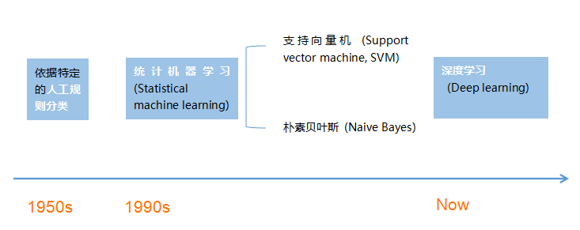

1. 对文本分类的研究可以追溯到二十世纪五十年代，当时主要依据特定的人工规则进行文本分类。
2. 到二十世纪九十年代，统计机器学习 (Statistical machine learning) 成为主流，一些统计机器学习方法，比如支持向量机和朴素贝叶斯等分类方法在文本分类中取得了非常高的分类准确率。然而，统计机器学习方法首先需要进行特征工程工作，该工作需要深入理解业务需求，并且非常耗时耗力。
3. 随着大数据量和图形处理单元强计算力的支持，深度学习近年来发展迅速，与统计机器学习方法相比，深度学习方法可以自动提取特征，使得人们将注意力更多地集中在数据和模型上。

# 方法

这里我们根据是否使用深度学习方法将文本分类主要分为一下两个大类：

- 基于机器学习的文本分类（不涉及实现以及实验结果的比较）。
- 基于深度学习的文本分类。

## 基于机器学习的文本分类

90年代后互联网在线文本数量增长和机器学习学科的兴起，逐渐形成了一套解决大规模文本分类问题的经典玩法，这个阶段的主要套路是人工特征工程+浅层分类模型。整个文本分类问题就拆分成了**特征工程**和**分类器**两部分。

### 特征工程

特征工程也就是将文本表示为计算机可以识别的、能够代表该文档特征的特征矩阵的过程。在基于传统机器学习的文本分类中，通常将特征工程分为**文本预处理、特征提取、文本表示**等三个部分。

#### 文本预处理

文本预处理过程是提取文本中的关键词来表示文本的过程。中文文本预处理主要包括文本分词和去停用词两个阶段。文本分词，是因为很多研究表明特征粒度为词粒度远好于字粒度（因为大部分分类算法不考虑词序信息，基于字粒度显然损失了过多`n-gram`信息）。具体到中文分词，不同于英文有天然的空格间隔，需要设计复杂的分词算法。传统分词算法主要有基于字符串匹配的正向/逆向/双向最大匹配；基于理解的句法和语义分析消歧；基于统计的互信息/CRF方法(`WordEmbedding+Bi-LSTM+CRF`方法逐渐成为主流)。 而停用词是文本中一些高频的代词、连词、介词等对文本分类无意义的词，通常维护一个停用词表，特征提取过程中删除停用表中出现的词，本质上属于特征选择的一部分。

#### 特征提取

特征提取包括**特征选择**和**特征权重计算**两部分。 特征选择的基本思路是根据某个评价指标独立的对原始特征项（词项）进行评分排序，从中选择得分最高的一些特征项，过滤掉其余的特征项。常用的评价有：文档频率、互信息、信息增益、χ²统计量等。特征权重计算主要是经典的TF-IDF方法及其扩展方法。

#### 文本表示

文本表示的目的是把文本预处理后的转换成计算机可理解的方式，是决定文本分类质量最重要的部分。


##### 词袋法

忽略其词序和语法，句法，将文本仅仅看做是一个词集合。若词集合共有NN个词，每个文本表示为一个`N`维向量，元素为`0/1`，表示该文本是否包含对应的词。`( 0, 0, 0, 0, .... , 1, ... 0, 0, 0, 0)`。一般来说词库量至少都是百万级别，因此词袋模型有个两个最大的问题：高纬度、高稀疏性。

##### n-gram 词袋模型

与词袋模型类似，考虑了局部的顺序信息，但是向量的维度过大，基本不采用。如果词集合大小为`N`，则bi-gram的单词总数为$n^2$向量空间模型。

##### 向量空间模型

以词袋模型为基础，向量空间模型通过特征选择降低维度，通过特征权重计算增加稠密性。

### 分类器

大部分机器学习方法都在文本分类领域有所应用，比如朴素贝叶斯分类算法、KNN、SVM、最大熵、GBDT/XGBoost等等。


## 基于深度学习的文本分类


### FastText

#### 简介

fastText是Facebook于2016年开源的一个词向量计算和文本分类工具,[论文地址](https://arxiv.org/pdf/1607.01759.pdf),其**特点**就是**fast**。在文本分类任务中，fastText（浅层网络）往往能取得和深度网络相媲美的精度，却在训练时间上比深度网络快许多数量级。在标准的多核CPU上， 在10分钟之内能够训练10亿词级别语料库的词向量，在1分钟之内能够分类有着30万多类别的50多万句子。

fastText是一个快速文本分类算法，与基于神经网络的分类算法相比有两大优点：

1. fastText在保持高精度的情况下加快了训练速度和测试速度
2. fastText不需要预训练好的词向量，fastText会自己训练词向量
3. fastText两个重要的优化：Hierarchical Softmax、N-gram

#### fastText模型架构

fastText模型架构和word2vec中的CBOW很相似， 不同之处是fastText预测标签而CBOW预测的是中间词，即模型架构类似但是模型的任务不同：

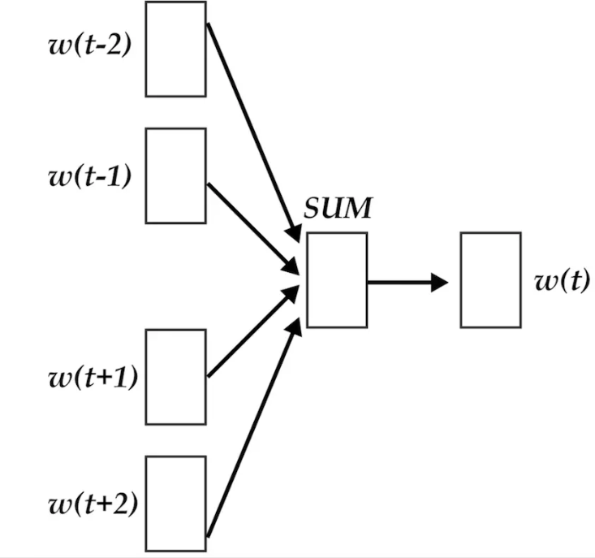

word2vec将上下文关系转化为多分类任务，进而训练逻辑回归模型。通常的文本数据中，词库少则数万，多则百万，在训练中直接训练多分类逻辑回归并不现实。word2vec中提供了两种针对大规模多分类问题的优化手段， negative sampling 和hierarchical softmax。在优化中，negative sampling 只更新少量负面类，从而减轻了计算量。hierarchical softmax 将词库表示成前缀树，从树根到叶子的路径可以表示为一系列二分类器，一次多分类计算的复杂度从|V|降低到了树的高度。
fastText模型架构:其中$x_1,x_2,\ldots,x_{N−1},x_N$表示一个文本中的n-gram向量，每个特征是词向量的平均值。

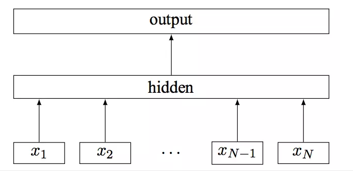

#### 缺点：

> 我不喜欢这类电影，但是喜欢这一个。
>
> 我喜欢这类电影，但是不喜欢这一个。

**这样的两句句子经过词向量平均以后已经送入单层神经网络的时候已经完全一模一样了，分类器不可能分辨出这两句话的区别**，只有添加n-gram特征以后才可能有区别。因此，在实际应用的时候需要对数据有足够的了解,然后在选择模型。

#### 模型代码


```python
class FastText(BaseModel):
    def __init__(self, output_dim, word_embedding, freeze):
        super().__init__()
        self.embedding_size = word_embedding.vectors.shape[1]
        self.embedding = nn.Embedding.from_pretrained(torch.from_numpy(word_embedding.vectors), freeze=freeze)

        self.fc = nn.Linear(self.embedding_size, output_dim)

    def forward(self, text,_, text_lengths):
        # text = [batch size,sent len]
        embedded = self.embedding(text)
        # embedded = [batch size, sent len, emb dim]
        pooled = F.avg_pool2d(embedded, (embedded.shape[1], 1)).squeeze(1)
        # pooled = [batch size, embedding_dim]
        return self.fc(pooled)
```

### TextCNN

#### 简介

**Yoon Kim**在论文[(2014 EMNLP) Convolutional Neural Networks for Sentence Classification](https://arxiv.org/abs/1408.5882)提出TextCNN。将卷积神经网络CNN应用到文本分类任务，利用多个不同size的kernel来提取句子中的关键信息，从而能够更好地捕捉局部相关性。

#### 网络结构


#### 原理

TextCNN的详细过程原理图如下：


TextCNN详细过程：

- Embedding：第一层是图中最左边的7乘5的句子矩阵，每行是词向量，维度=5，这个可以类比为图像中的原始像素点。
- Convolution：然后经过 `kernel_sizes=(2,3,4) `的一维卷积层，每个kernel_size 有两个输出 channel。
- MaxPolling：第三层是一个`1-max pooling`层，这样不同长度句子经过pooling层之后都能变成定长的表示。
- FullConnection and Softmax：最后接一层全连接的 softmax 层，输出每个类别的概率。

#### 缺点

TextCNN模型最大的问题也是这个全局的max pooling丢失了结构信息，因此很难去发现文本中的转折关系等复杂模式。针对这个问题，可以尝试k-max pooling做一些优化，k-max pooling针对每个卷积核都不只保留最大的值，他保留前k个最大值，并且保留这些值出现的顺序，也即按照文本中的位置顺序来排列这k个最大值。在某些比较复杂的文本上相对于1-max pooling会有提升。

#### 代码


```python
class TextCNN(BaseModel):
    def __init__(self, n_filters, filter_sizes, output_dim, dropout, word_embedding, freeze):
        # n_filter 每个卷积核的个数
        super().__init__()
        self.embedding_size = word_embedding.vectors.shape[1]
        self.embedding = nn.Embedding.from_pretrained(torch.from_numpy(word_embedding.vectors), freeze=freeze)
        self.convs = nn.ModuleList(
            [nn.Conv2d(in_channels=1, out_channels=n_filters, kernel_size=(fs, self.embedding_size)) for fs in
             filter_sizes])
        self.fc = nn.Linear(len(filter_sizes) * n_filters, output_dim)
        self.dropout = nn.Dropout(dropout)

    def forward(self, text, _, text_lengths):
        # text = [batch size, sent len]
        embedded = self.embedding(text)
        # embedded = [batch size, sent len, emb dim]
        embedded = embedded.unsqueeze(1)
        # embedded = [batch size, 1, sent len, emb dim]
        conved = [F.relu(conv(embedded)).squeeze(3) for conv in self.convs]
        # conved_n = [batch size, n_filters, sent len - filter_sizes[n] + 1]
        pooled = [F.max_pool1d(conv, conv.shape[2]).squeeze(2) for conv in conved]
        # pooled_n = [batch size, n_filters]
        cat = self.dropout(torch.cat(pooled, dim=1))
        # cat = [batch size, n_filters * len(filter_sizes)]
        return self.fc(cat)


class TextCNN1d(nn.Module):
    def __init__(self, n_filters, filter_sizes, output_dim, dropout, word_embedding, freeze):
        super().__init__()
        self.embedding_size = word_embedding.vectors.shape[1]
        self.embedding = nn.Embedding.from_pretrained(torch.from_numpy(word_embedding.vectors), freeze=freeze)
        self.convs = nn.ModuleList(
            [nn.Conv1d(in_channels=self.embedding_size, out_channels=n_filters, kernel_size=fs) for fs in filter_sizes])

        self.fc = nn.Linear(len(filter_sizes) * n_filters, output_dim)

        self.dropout = nn.Dropout(dropout)

    def forward(self, text, _, text_lengths):
        # text = [batch size, sent len]
        embedded = self.embedding(text)
        # embedded = [batch size, sent len, emb dim]
        embedded = embedded.permute(0, 2, 1)
        # embedded = [batch size, emb dim, sent len]
        conved = [F.relu(conv(embedded)) for conv in self.convs]
        # conved_n = [batch size, n_filters, sent len - filter_sizes[n] + 1]
        pooled = [F.max_pool1d(conv, conv.shape[2]).squeeze(2) for conv in conved]
        # pooled_n = [batch size, n_filters]
        cat = self.dropout(torch.cat(pooled, dim=1))
        # cat = [batch size, n_filters * len(filter_sizes)]
        return self.fc(cat)
```

### DPCNN

#### 简介：

ACL2017年中，腾讯AI-lab提出了Deep Pyramid Convolutional Neural Networks for Text Categorization([DPCNN](https://ai.tencent.com/ailab/media/publications/ACL3-Brady.pdf))。论文中提出了一种基于word-level级别的网络-DPCNN，由于TextCNN 不能通过卷积获得文本的长距离依赖关系，而论文中DPCNN通过不断加深网络，可以抽取长距离的文本依赖关系。实验证明在不增加太多计算成本的情况下，增加网络深度就可以获得最佳的准确率。‍

#### 网络结构

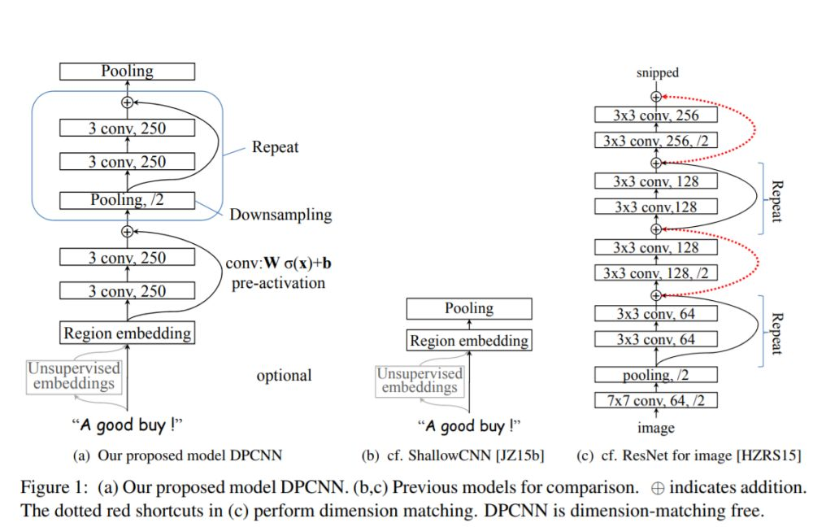

##### Region embedding

作者将TextCNN的包含多尺寸卷积滤波器的卷积层的卷积结果称之为`Region embedding`，意思就是对一个文本区域/片段（比如`3-gram`）进行一组卷积操作后生成的embedding。
卷积操作有两种选择：

1. 保留词序：也就是设置一组`size=3*D`的二维卷积核对`3-gram`进行卷积（其中D是word embedding维度）
2. 不保留词序（即使用词袋模型），即首先对`3-gram`中的3个词的embedding取均值得到一个size=D的向量，然后设置一组size=D的一维卷积核对该`3-gram`进行卷积。

TextCNN里使用的是保留词序的做法，而DPCNN使用的是词袋模型的做法，DPCNN作者认为前者做法更容易造成过拟合，后者的性能却跟前者差不多。

#### 卷积和全连接的权衡

产生`region embedding`后，按照经典的TextCNN的做法的话，就是从每个特征图中挑选出最有代表性的特征，也就是直接应用全局最大池化层，这样就生成了这段文本的特征向量,假如卷积滤波器的size有3，4，5这三种，每种size包含100个卷积核，那么当然就会产生3*100幅特征图，然后将max-over-time-pooling操作应用到每个特征图上，于是文本的特征向量即3*100=300维。
TextCNN这样做的意义本质上与`词袋模型(n-gram)+weighting+NB/MaxEnt/SVM`的经典文本分类模型没本质区别，只不过one-hot表示到word embedding表示的转变避免了词袋模型遭遇的数据稀疏问题。TextCNN本质上收益于词向量的引入带来的近义词有相近向量表示的bonus，同时TextCNN可以较好的利用词向量中近义关系。**经典模型里难以学习的远距离信息在TextCNN中依然难以学习**。

##### 等长卷积

假设输入的序列长度为$n$，卷积核大小为$m$，步长为$s$,输入序列两端各填补$p$个零,那么该卷积层的输出序列为$\frac{(n-m+2p)}{s}+1$。

1. 窄卷积:步长$s=1$,两端不补零，即$p=0$，卷积后输出长度为$n-m+1$。
2. 宽卷积:步长$s=1$,两端补零$p=m-1$，卷积后输出长度$n+m-1$。
3. 等长卷积: 步长$s=1$,两端补零$p=(m-1)/2$，卷积后输出长度为$n$。

将输入输出序列的第n个embedding称为第n个词位，那么这时size为n的卷积核产生的等长卷积的意义就是将输入序列的每个词位及其左右$\frac{n-1}{2}$个词的上下文信息压缩为该词位的embedding，产生了每个词位的被上下文信息修饰过的更高level更加准确的语义。想要克服TextCNN的缺点，捕获长距离模式，显然就要用到深层CNN。

直接等长卷积堆等长卷积会让每个词位包含进去越来越多，越来越长的上下文信息，这种方式会让网络层数变得非常非常非常深，但是这种方式太笨重。不过，既然等长卷积堆等长卷积会让每个词位的embedding描述语义描述的更加丰富准确，可以适当的堆两层来提高词位embedding的表示的丰富性。
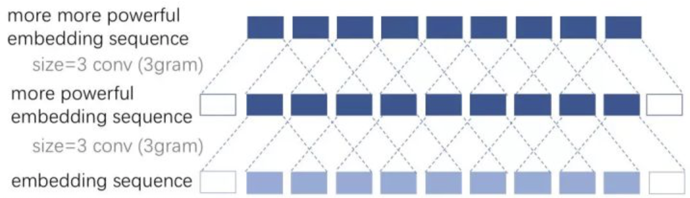


##### 固定feature map的数量

在表示好每个词位的语义后，很多邻接词或者邻接`ngram`的词义是可以合并，例如“小明 人 不要 太好”中的“不要”和“太好”虽然语义本来离得很远，但是作为邻接词“不要太好”出现时其语义基本等价为“很好”，完全可以把“不要”和“太好”的语义进行合并。同时，合并的过程完全可以在原始的embedding space中进行的，原文中直接把“不要太好”合并为“很好”是很可以的，完全没有必要动整个语义空间。
实际上，相比图像中这种从“点、线、弧”这种low-level特征到“眼睛、鼻子、嘴”这种high-level特征的明显层次性的特征区分，文本中的特征进阶明显要扁平的多，即从单词（1gram）到短语再到3gram、4gram的升级，其实很大程度上均满足“语义取代”的特性。而图像中就很难发生这种“语义取代”现象。因此，DPCNN与ResNet很大一个不同就是，**在DPCNN中固定死了feature map的数量**，也就是固定住了embedding space的维度（为了方便理解，以下简称语义空间），使得网络有可能让整个邻接词（邻接ngram）的合并操作在原始空间或者与原始空间相似的空间中进行（当然，网络在实际中会不会这样做是不一定的，只是提供了这么一种条件）。也就是说，整个网络虽然形状上来看是深层的，但是从语义空间上来看完全可以是扁平的。而ResNet则是不断的改变语义空间，使得图像的语义随着网络层的加深也不断的跳向更高level的语义空间。

##### **池化**

每经过一个$size=3,stride=2$的池化层(简称$1/2$池化层)，序列的长度就被压缩成了原来的一半。这样同样是$size=3$的卷积核，每经过一个$1/2$池化层后，其能感知到的文本片段就比之前长了一倍。例如之前是只能感知3个词位长度的信息，经过1/2池化层后就能感知6个词位长度的信息，这时把1/2池化层和size=3的卷积层组合起来如图：


##### 残差连接

在初始化深度CNN时，往往各层权重都是初始化为一个很小的值，这就导致最开始的网络中，后续几乎每层的输入都是接近0，这时网络的输出自然是没意义的，而这些小权重同时也阻碍了梯度的传播，使得网络的初始训练阶段往往要迭代好久才能启动。同时，就算网络启动完成，由于深度网络中仿射矩阵近似连乘，训练过程中网络也非常容易发生梯度爆炸或弥散问题（虽然由于非共享权重，深度CNN网络比RNN网络要好点）。
针对深度CNN网络的梯度弥散问题ResNet中提出的`shortcut-connection/skip-connection/residual-connection`（残差连接）就是一种非常简单、合理、有效的解决方案。
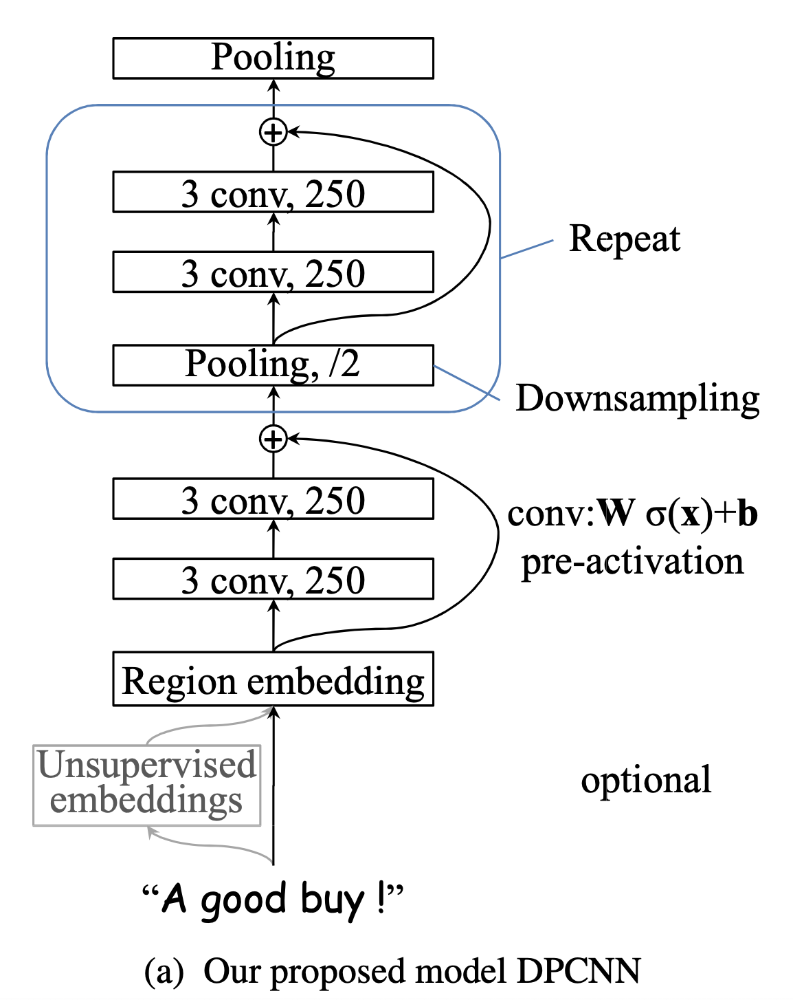
既然每个block的输入在初始阶段容易是0而无法激活，那么直接用一条线把region embedding层连接到每个block的输入乃至最终的池化层/输出层。有了shortcut后，梯度就可以忽略卷积层权重的削弱，从shortcut一路无损的传递到各个block，直至网络前端，从而极大的缓解了梯度消失问题。

#### 代码

```python
class DPCNN(nn.Module):
    def __init__(self,num_filters, num_classes,word_embedding, freeze):
        super(DPCNN, self).__init__()

        self.embedding_size = word_embedding.vectors.shape[1]
        self.embedding = nn.Embedding.from_pretrained(torch.from_numpy(word_embedding.vectors), freeze=freeze)

        self.conv_region = nn.Conv2d(1, num_filters, (3, self.embedding_size), stride=1)
        self.conv = nn.Conv2d(num_filters, num_filters, (3, 1), stride=1)

        self.max_pool = nn.MaxPool2d(kernel_size=(3, 1), stride=2)
        self.padding1 = nn.ZeroPad2d((0, 0, 1, 1))  # top bottom
        self.padding2 = nn.ZeroPad2d((0, 0, 0, 1))  # bottom

        self.relu = nn.ReLU()
        self.fc = nn.Linear(num_filters, num_classes)

    def forward(self, text,_, text_lengths):
        # text [batch_size,seq_len]
        x = self.embedding(text)  # x=[batch_size,seq_len,embedding_dim]
        x = x.unsqueeze(1)  # [batch_size, 1, seq_len, embedding_dim]
        x = self.conv_region(x)  # x = [batch_size, num_filters, seq_len-3+1, 1]

        x = self.padding1(x)  # [batch_size, num_filters, seq_len, 1]
        x = self.relu(x)
        x = self.conv(x)  # [batch_size, num_filters, seq_len-3+1, 1]
        x = self.padding1(x)  # [batch_size, num_filters, seq_len, 1]
        x = self.relu(x)
        x = self.conv(x)  # [batch_size, num_filters, seq_len-3+1, 1]
        while x.size()[2] >= 2:
            x = self._block(x)  # [batch_size, num_filters,1,1]
        x = x.squeeze()  # [batch_size, num_filters]
        x = self.fc(x)  # [batch_size, 1]
        return x

    def _block(self, x):
        x = self.padding2(x)
        px = self.max_pool(x)

        x = self.padding1(px)
        x = F.relu(x)
        x = self.conv(x)

        x = self.padding1(x)
        x = F.relu(x)
        x = self.conv(x)

        # Short Cut
        x = x + px
        return x
```

### RNN系列

#### RNN

通过将前一时刻的运算结果添加到当前的运算中，从而实现了“考虑上文信息”的功能。


RNN可以考虑上文的信息，那么如何将下文的信息也添加进去呢？这就是BiRNN要做的事情。

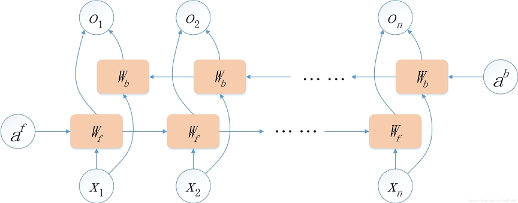

#### LSTM

因为RNN存在梯度弥散和梯度爆炸的问题，所以RNN很难完美地处理具有长期依赖的信息。既然仅仅依靠一条线连接后面的神经元不足以解决问题，那么就再加一条线(这条线实现的功能是把rnn中的累乘变成了累加)，这就是LSTM。

LSTM的关键在于细胞的状态和穿过细胞的线，细胞状态类似于传送带。直接在整个链上运行，只有一些少量的线性交互。信息在上面流动保持不变会变得容易。

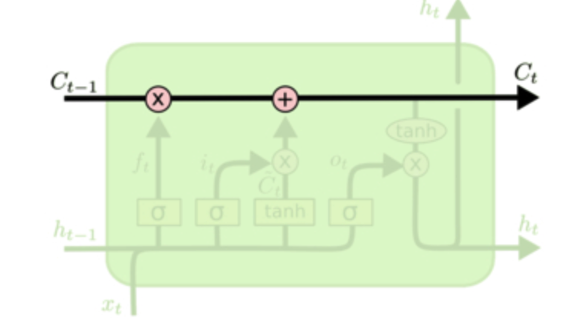

在LSTM中，门可以实现选择性的让信息通过，主要通过一个sigmoid的神经层和一个逐点相乘的操作来实现。LSTM通过三个这样的门结构来实现信息的保护和控制，分别是遗忘门（forget gate）、输入门（input gate）与输出门（output gate）。

##### **遗忘门**

在LSTM中的第一步是决定从细胞状态中丢弃什么信息。这个决定通过一个称为遗忘门的结构来完成。遗忘门会读取$h_{t-1}$和$x_t$，输出一个0到1之间的数值给细胞的状态$c_{t-1}$中的数字。1表示完全保留，0表示完全舍弃。

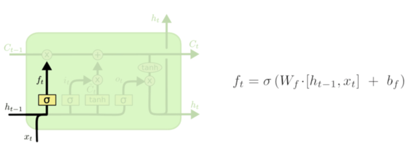

##### **输入门**

遗忘门决定让多少新的信息加入到cell的状态中来。实现这个需要两个步骤：

1. 首先一个叫“input gate layer”的sigmoid层决定哪些信息需要更新；一个tanh层生成一个向量，用来更新状态C。

   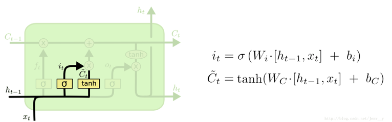

2. 把 1 中的两部分联合起来，对cell的状态进行更新，我们把旧的状态与$f_t$相乘，丢弃掉我们确定需要丢弃的信息，接着加上$i_t * \tilde{C}_{t}$

##### 输出门

最终，我们需要确定输出什么值，这个输出将会基于我们的细胞的状态，但是也是一个过滤后的版本。首先，我们通过一个sigmoid层来确定细胞状态的哪些部分将输出出去。接着，我们把细胞状态通过tanh进行处理（得到一个-1到1之间的值）并将它和sigmoid门的输出相乘，最终我们仅仅会输出我们确定输出的部分。

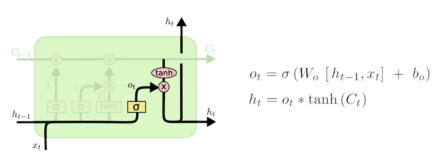

##### 公式


#### GRU

在LSTM中引入了三个门函数：输入门、遗忘门和输出门来控制输入值、记忆值和输出值。而在GRU模型中只有两个门：分别是更新门和重置门。


图中的$z_t$和$r_t$分别表示更新门和重置门。更新门用于控制前一时刻的状态信息被带入到当前状态中的程度，更新门的值越大说明前一时刻的状态信息带入越多。重置门控制前一状态有多少信息被写入到当前的候选集 $\tilde{h}_{t}$上，重置门越小，前一状态的信息被写入的越少。

LSTM和CRU都是通过各种门函数来将重要特征保留下来，这样就保证了在long-term传播的时候也不会丢失。此外GRU相对于LSTM少了一个门函数，因此在参数的数量上也是要少于LSTM的，所以整体上GRU的训练速度要快于LSTM的。

#### 代码


```python
class RnnModel(BaseModel):
    def __init__(self, rnn_type, hidden_dim, output_dim, n_layers,bidirectional, dropout,word_embedding, freeze,batch_first=True):
        super().__init__()
        self.rnn_type = rnn_type.lower()
        self.bidirectional = bidirectional
        self.hidden_dim = hidden_dim
        self.n_layers = n_layers
        self.embedding_size = word_embedding.vectors.shape[1]
        self.embedding = nn.Embedding.from_pretrained(torch.from_numpy(word_embedding.vectors), freeze=freeze)

        if rnn_type == 'lstm':
            self.rnn = nn.LSTM(self.embedding_size,
                               hidden_dim,
                               num_layers=n_layers,
                               bidirectional=bidirectional,
                               batch_first=batch_first,
                               dropout=dropout)
        elif rnn_type == 'gru':
            self.rnn = nn.GRU(self.embedding_size,
                              hidden_size=hidden_dim,
                              num_layers=n_layers,
                              bidirectional=bidirectional,
                              batch_first=batch_first,
                              dropout=dropout)
        else:
            self.rnn = nn.RNN(self.embedding_size,
                              hidden_size=hidden_dim,
                              num_layers=n_layers,
                              bidirectional=bidirectional,
                              batch_first=batch_first,
                              dropout=dropout)

        self.fc = nn.Linear(hidden_dim * n_layers, output_dim)

        self.dropout = nn.Dropout(dropout)
        self.batch_first = batch_first

    def forward(self, text,_, text_lengths):
        # 按照句子长度从大到小排序
        text, sorted_seq_lengths, desorted_indices = prepare_pack_padded_sequence(text, text_lengths)
        # text = [batch size,sent len]
        embedded = self.dropout(self.embedding(text))
        # embedded = [batch size, sent len, emb dim]

        # pack sequence
        packed_embedded = nn.utils.rnn.pack_padded_sequence(embedded, sorted_seq_lengths, batch_first=self.batch_first)

        if self.rnn_type in ['rnn', 'gru']:
            packed_output, hidden = self.rnn(packed_embedded)
        else:
            # output (seq_len, batch, num_directions * hidden_size)
            # hidden (num_layers * num_directions, batch, hidden_size)
            packed_output, (hidden, cell) = self.rnn(packed_embedded)

        # unpack sequence
        output, output_lengths = nn.utils.rnn.pad_packed_sequence(packed_output, batch_first=self.batch_first)
        # 把句子序列再调整成输入时的顺序
        output = output[desorted_indices]
        # output = [batch_size,seq_len,hidden_dim * num_directionns ]
        batch_size, max_seq_len,hidden_dim = output.shape
        hidden = torch.mean(torch.reshape(hidden,[batch_size,-1,hidden_dim]),dim=1)
        output = torch.sum(output,dim=1)
        fc_input = self.dropout(output + hidden)
        out = self.fc(fc_input)

        return out
```


#### Self-Attention

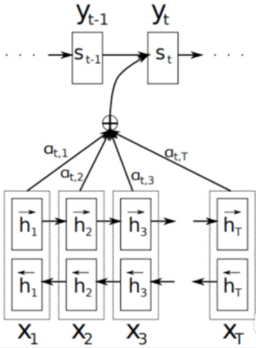

1. Encode所有输入序列,得到对应的$h_1,h_2, \cdots ,h_T$(T为输入序列长度)
2. Decode输出目标$y_t$之前，会将上一步输出的隐藏状态$S_{t-1}$与之前encode好的$h_1,h_2,\cdots,h_T$进行比对，计算相似度（$e_{t,j}=a(s_{t-1},h_j)$）,$h_j$为之前第j个输入encode得到的隐藏向量，a为任意一种计算相似度的方式
3. 然后通过softmax，即$a_{t,j}=\frac{exp(e_{t,j})}{\sum^{T_x}_{k=1}exp(e_{t,k})}$将之前得到的各个部分的相关系数进行归一化，得到$a_{t,1},a_{t,2},\cdots,a_{t,T}$
4. 在对输入序列的隐藏层进行相关性加权求和得到此时decode需要的context vector ：

#### Rnn-Attenton


```python
class RnnAttentionModel(BaseModel):
    def __init__(self, rnn_type, hidden_dim, output_dim, n_layers,bidirectional, dropout,word_embedding, freeze, batch_first=True):
        super().__init__()
        self.rnn_type = rnn_type.lower()
        self.bidirectional = bidirectional
        self.hidden_dim = hidden_dim
        self.n_layers = n_layers
        self.batch_first = batch_first
        self.embedding_size = word_embedding.vectors.shape[1]
        self.embedding = nn.Embedding.from_pretrained(torch.from_numpy(word_embedding.vectors), freeze=freeze)


        if rnn_type == 'lstm':
            self.rnn = nn.LSTM(self.embedding_size,
                               hidden_dim,
                               num_layers=n_layers,
                               bidirectional=bidirectional,
                               batch_first=batch_first,
                               dropout=dropout)
        elif rnn_type == 'gru':
            self.rnn = nn.GRU(self.embedding_size,
                              hidden_size=hidden_dim,
                              num_layers=n_layers,
                              bidirectional=bidirectional,
                              batch_first=batch_first,
                              dropout=dropout)
        else:
            self.rnn = nn.RNN(self.embedding_size,
                              hidden_size=hidden_dim,
                              num_layers=n_layers,
                              bidirectional=bidirectional,
                              batch_first=batch_first,
                              dropout=dropout)

        self.tanh1 = nn.Tanh()
        self.tanh2 = nn.Tanh()
        # self.u = nn.Parameter(torch.Tensor(self.hidden_dim * 2,self.hidden_dim*2))
        self.w = nn.Parameter(torch.randn(hidden_dim), requires_grad=True)

        self.dropout = nn.Dropout(dropout)
        if bidirectional:
            self.w = nn.Parameter(torch.randn(hidden_dim * 2), requires_grad=True)
            self.fc = nn.Linear(hidden_dim * 2, output_dim)
        else:
            self.w = nn.Parameter(torch.randn(hidden_dim), requires_grad=True)
            self.fc = nn.Linear(hidden_dim, output_dim)

    def forward(self, text,_, text_lengths):
        # 按照句子长度从大到小排序
        text, sorted_seq_lengths, desorted_indices = prepare_pack_padded_sequence(text, text_lengths)
        # text = [batch size,sent len]
        embedded = self.dropout(self.embedding(text))
        # embedded = [batch size,sent len,  emb dim]

        # pack sequence
        packed_embedded = nn.utils.rnn.pack_padded_sequence(embedded, sorted_seq_lengths, batch_first=self.batch_first)

        if self.rnn_type in ['rnn', 'gru']:
            packed_output, hidden = self.rnn(packed_embedded)
        else:
            packed_output, (hidden, cell) = self.rnn(packed_embedded)

        # unpack sequence
        # output = [sent len, batch size, hidden dim * num_direction]
        output, output_lengths = nn.utils.rnn.pad_packed_sequence(packed_output, batch_first=self.batch_first)
        # 把句子序列再调整成输入时的顺序
        output = output[desorted_indices]
        # attention
        # M = [sent len, batch size, hidden dim * num_direction]
        # M = self.tanh1(output)
        alpha = F.softmax(torch.matmul(self.tanh1(output), self.w), dim=0).unsqueeze(-1)  # dim=0表示针对文本中的每个词的输出softmax
        output_attention = output * alpha

        batch_size, max_seq_len,hidden_dim = output.shape
        hidden = torch.mean(torch.reshape(hidden,[batch_size,-1,hidden_dim]),dim=1)

        output_attention = torch.sum(output_attention, dim=1)
        output = torch.sum(output, dim=1)

        fc_input = self.dropout(output + output_attention + hidden)
        # fc_input = self.dropout(output_attention)
        out = self.fc(fc_input)
        return out
```

### TextRCNN

#### 简介

RNN和CNN作为文本分类问题的主要模型架构，都存在各自的优点及局限性。RNN擅长处理序列结构，能够考虑到句子的上下文信息，但RNN属于“biased model”，一个句子中越往后的词重要性越高，这有可能影响最后的分类结果，因为对句子分类影响最大的词可能处在句子任何位置。CNN属于无偏模型，能够通过最大池化获得最重要的特征，但是CNN的滑动窗口大小不容易确定，选的过小容易造成重要信息丢失，选的过大会造成巨大参数空间。为了解决二者的局限性，[RCNN](http://www.aaai.org/ocs/index.php/AAAI/AAAI15/paper/download/9745/9552)这篇文章提出了一种新的网络架构，用双向循环结构获取上下文信息，这比传统的基于窗口的神经网络更能减少噪声，而且在学习文本表达时可以大范围的保留词序。其次使用最大池化层获取文本的重要部分，自动判断哪个特征在文本分类过程中起更重要的作用。

#### 模型结构


#### Word Representation Learning

作者提出将单词的左上下文、右上下文、单词本身结合起来作为单词表示。作者使用了双向RNN来分别提取句子的上下文信息。公式如下:
$$
\begin{array}{l}
c_{l}\left(w_{i}\right)=f\left(W^{(l)} c_{l}\left(w_{i-1}\right)+W^{(s l)} e\left(w_{i-1}\right)\right)  \\
c_{r}\left(w_{i}\right)=f\left(W^{(r)} c_{r}\left(w_{i+1}\right)+W^{(s r)} e\left(w_{i+1}\right)\right)
\end{array}
$$
其中，$c_l(w_i)$代表单词$w_i$的左上下文，$c_l(w_i)$由上一个单词的左上下文$c_l$和$c_l(w_{i-1})$上一个单词的词嵌入向量 $e(w_{i-1})$计算得到，如公式（1）所示，所有句子第一个单词的左侧上下文使用相同的共享参数$c_l(w_1)$。 $W^{(l)},W^{(sl)}$用于将上一个单词的左上下文语义和上一个单词的语义结合到单词 $w_i$的左上下文表示中。右上下文的处理与左上下文完全相同，同样所有句子最后一个单词的右侧上下文使用相同的共享参数$c_r(w_n)$。 得到句子中每个单词的左上下文表示和右上下文表示后，就可以定义单词  $w_i$的表示如下
$$
\boldsymbol{x}_{i}=\left[\boldsymbol{c}_{l}\left(w_{i}\right) ; \boldsymbol{e}\left(w_{i}\right) ; \boldsymbol{c}_{r}\left(w_{i}\right)\right]
$$


实际就是单词$w_i$，单词的词嵌入表示向量 $e(w_i)$以及单词的右上下文向量$c_e(w_i)$ 的拼接后的结果。得到$w_i$的表示$x_i$后，就可以输入激活函数得到$w_i$的潜在语义向量 $y_i^{(2)}$ 。
$$
\boldsymbol{y}_{i}^{(2)}=\tanh \left(W^{(2)} \boldsymbol{x}_{i}+\boldsymbol{b}^{(2)}\right)
$$


#### Text Representation Learning

经过卷积层后，获得了所有词的表示，首先对其进行最大池化操作，最大池化可以帮助找到句子中最重要的潜在语义信息。
$$
\boldsymbol{y}^{(3)}=\max _{i=1}^{n} \boldsymbol{y}_{i}^{(2)}
$$
然后经过全连接层得到文本的表示，最后通过softmax层进行分类。
$$
\begin{aligned}
&\boldsymbol{y}^{(4)}=W^{(4)} \boldsymbol{y}^{(3)}+\boldsymbol{b}^{(4)}\\
&p_{i}=\frac{\exp \left(\boldsymbol{y}_{i}^{(4)}\right)}{\sum_{k=1}^{n} \exp \left(\boldsymbol{y}_{k}^{(4)}\right)}
\end{aligned}
$$

#### 代码


```python
class RCNNModel(BaseModel):
    def __init__(self, rnn_type, hidden_dim, output_dim, n_layers,bidirectional, dropout,word_embedding, freeze, batch_first=True):
        super().__init__()
        self.rnn_type = rnn_type.lower()
        self.bidirectional = bidirectional
        self.hidden_dim = hidden_dim
        self.n_layers = n_layers
        self.embedding_size = word_embedding.vectors.shape[1]
        self.embedding = nn.Embedding.from_pretrained(torch.from_numpy(word_embedding.vectors), freeze=freeze)

        if rnn_type == 'lstm':
            self.rnn = nn.LSTM(self.embedding_size ,
                               hidden_dim,
                               num_layers=n_layers,
                               bidirectional=bidirectional,
                               batch_first=batch_first,
                               dropout=dropout)
        elif rnn_type == 'gru':
            self.rnn = nn.GRU(self.embedding_size ,
                              hidden_size=hidden_dim,
                              num_layers=n_layers,
                              bidirectional=bidirectional,
                              batch_first=batch_first,
                              dropout=dropout)
        else:
            self.rnn = nn.RNN(self.embedding_size ,
                              hidden_size=hidden_dim,
                              num_layers=n_layers,
                              bidirectional=bidirectional,
                              batch_first=batch_first,
                              dropout=dropout)


        self.fc_cat = nn.Linear(hidden_dim * n_layers + self.embedding_size,self.embedding_size)
        self.fc = nn.Linear(self.embedding_size, output_dim)
        self.dropout = nn.Dropout(dropout)
        self.batch_first = batch_first

    def forward(self, text,_, text_lengths):
        # 按照句子长度从大到小排序
        text, sorted_seq_lengths, desorted_indices = prepare_pack_padded_sequence(text, text_lengths)
        # text = [batch size,sent len]
        embedded = self.dropout(self.embedding(text))
        # embedded = [batch size, sent len, emb dim]
        # pack sequence
        packed_embedded = nn.utils.rnn.pack_padded_sequence(embedded, sorted_seq_lengths, batch_first=self.batch_first)

        # packed_output
        # hidden [n_layers * bi_direction,batch_size,hidden_dim]
        if self.rnn_type in ['rnn', 'gru']:
            packed_output, hidden = self.rnn(packed_embedded)
        else:
            packed_output, (hidden, cell) = self.rnn(packed_embedded)

        # unpack sequence
        # output [sent len, batch_size * n_layers * bi_direction]
        output, output_lengths = nn.utils.rnn.pad_packed_sequence(packed_output, batch_first=self.batch_first)
        # 把句子序列再调整成输入时的顺序
        output = output[desorted_indices]
        # output = [batch_size,seq_len,hidden_dim * num_directionns ]
        batch_size, max_seq_len,hidden_dim = output.shape
        # 拼接左右上下文信息
        output = torch.tanh(self.fc_cat(torch.cat((output, embedded), dim=2)))

        output = torch.transpose(output,1,2)
        output = F.max_pool1d(output,max_seq_len).squeeze().contiguous()
        output = self.fc(output)

        return output
```

### HAN


整个网络结构包括五个部分：

1. 词序列编码器
2. 基于词级的注意力层
3. 句子编码器
4. 基于句子级的注意力层
5. 分类

整个网络结构由双向GRU网络和注意力机制组合而成。

#### 词序列编码器

给定一个句子中的单词$w_{it}$，其中 $i$ 表示第$i$ 个句子，$t$ 表示第 $t$ 个词。通过一个词嵌入矩阵 $W_e$ 将单词转换成向量表示，具体如下所示：
$$
x_{it}=W_e w_{it}
$$

利用双向GRU实现的整个编码流程：
$$
\begin{aligned}
x_{i t} &=W_{e} w_{i t}, t \in[1, T] \\
\overrightarrow{h}_{i t} &=\overrightarrow{\operatorname{GRU}}\left(x_{i t}\right), t \in[1, T] \\
\overleftarrow{h}_{i t} &=\overleftarrow{\operatorname{GRU}}\left(x_{i t}\right), t \in[T, 1] \\
{h}_{i t} &= [\overrightarrow{h}_{i t},\overleftarrow{h}_{i t} ]
\end{aligned}
$$


#### 词级的注意力层

但是对于一句话中的单词，并不是每一个单词对分类任务都是有用的，比如在做文本的情绪分类时，可能我们就会比较关注“很好”、“伤感”这些词。为了能使循环神经网络也能自动将“注意力”放在这些词汇上，作者设计了基于单词的注意力层的具体流程如下：
$$
\begin{aligned}
u_{i t} &=\tanh \left(W_{w} h_{i t}+b_{w}\right) \\
\alpha_{i t} &=\frac{\exp \left(u_{i t}^{\top} u_{w}\right)}{\sum_{t} \exp \left(u_{i t}^{\top} u_{w}\right)} \\
s_{i} &=\sum_{t} \alpha_{i t} h_{i t}
\end{aligned}
$$
上面式子中，$u_{it}$ 是 $h_{it}$ 的隐层表示，$a_{it}$ 是经 softmax 函数处理后的归一化权重系数，$u_w$是一个随机初始化的向量，之后会作为模型的参数一起被训练，$s_i$ 就是我们得到的第 i 个句子的向量表示。

#### 句子编码器

句子编码器也是基于双向GRU实现编码的，
$$
\begin{aligned}
&\overrightarrow{h}_{i}=\overrightarrow{\operatorname{GRU}}\left(s_{i}\right), i \in[1, L]\\
&\overleftarrow{h}_{i}=\overleftarrow{\operatorname{GRU}}\left(s_{i}\right), t \in[L, 1]
\end{aligned}
$$
公式和词编码类似，最后的 $h_i$ 也是通过拼接得到的.

#### 句子级注意力层

注意力层的流程如下，和词级的一致:
$$
\begin{aligned}
u_{i} &=\tanh \left(W_{s} h_{i}+b_{s}\right) \\
\alpha_{i} &=\frac{\exp \left(u_{i}^{\top} u_{s}\right)}{\sum_{i} \exp \left(u_{i}^{\top} u_{s}\right)} \\
v &=\sum_{i} \alpha_{i} h_{i}
\end{aligned}
$$
最后得到的向量$v$ 就是文档的向量表示，这是文档的高层表示。接下来就可以用可以用这个向量表示作为文档的特征。

#### 分类

使用最常用的softmax分类器对整个文本进行分类了
$$
p=\operatorname{softmax}\left(W_{c} v+b_{c}\right)
$$
损失函数
$$
L=-\sum_{d} \log p_{d j}
$$

#### 代码


```python
class HierAttNet(BaseModel):
    def __init__(self,rnn_type, word_hidden_size, sent_hidden_size, num_classes, word_embedding,n_layers,bidirectional,batch_first,freeze,dropout):
        super(HierAttNet, self).__init__()
        self.word_embedding = word_embedding
        self.word_hidden_size = word_hidden_size
        self.sent_hidden_size = sent_hidden_size
        self.word_att_net = WordAttNet(rnn_type,word_embedding, word_hidden_size,n_layers,bidirectional,batch_first,dropout,freeze)
        self.sent_att_net = SentAttNet(rnn_type,sent_hidden_size, word_hidden_size,n_layers,bidirectional,batch_first,dropout, num_classes)


    def forward(self, batch_doc, _, text_lengths):
        output_list = []
        # ############################ 词级 #########################################
        for idx,doc in enumerate(batch_doc):
            # 把一篇文档拆成多个句子
            doc = doc[:text_lengths[idx]]
            doc_list = doc.cpu().numpy().tolist()
            sep_index = [i for i, num in enumerate(doc_list) if num == self.word_embedding.stoi['[SEP]']]
            sentence_list = []
            if sep_index:
                pre = 0
                for cur in sep_index:
                    sentence_list.append(doc_list[pre:cur])
                    pre = cur

                sentence_list.append(doc_list[cur:])

            else:
                sentence_list.append(doc_list)
            max_sentence_len = len(max(sentence_list,key=lambda x:len(x)))
            seq_lens = []
            input_token_ids = []
            for sent in sentence_list:
                cur_sent_len = len(sent)
                seq_lens.append(cur_sent_len)
                input_token_ids.append(sent+[self.word_embedding.stoi['PAD']]*(max_sentence_len-cur_sent_len))
            input_token_ids = torch.LongTensor(np.array(input_token_ids)).to(batch_doc.device)
            seq_lens = torch.LongTensor(np.array(seq_lens)).to(batch_doc.device)
            word_output, hidden = self.word_att_net(input_token_ids,seq_lens)
            # word_output = [bs,hidden_size]
            output_list.append(word_output)

        max_doc_sent_num = len(max(output_list,key=lambda x: len(x)))
        batch_sent_lens = []
        batch_sent_inputs = []
        
        # ############################ 句子级 #########################################
        for doc in output_list:
            cur_doc_sent_len = len(doc)
            batch_sent_lens.append(cur_doc_sent_len)
            expand_doc = torch.cat([doc,torch.zeros(size=((max_doc_sent_num-cur_doc_sent_len),len(doc[0]))).to(doc.device)],dim=0)
            batch_sent_inputs.append(expand_doc.unsqueeze(dim=0))

        batch_sent_inputs = torch.cat(batch_sent_inputs, 0)
        batch_sent_lens = torch.LongTensor(np.array(batch_sent_lens)).to(doc.device)
        output = self.sent_att_net(batch_sent_inputs,batch_sent_lens)
        return output
```


### Bert 

#### BERT


##### Task 1: MLM

由于BERT需要通过上下文信息，来预测中心词的信息，同时又不希望模型提前看见中心词的信息，因此提出了一种 Masked Language Model 的预训练方式，即随机从输入预料上 mask 掉一些单词，然后通过的上下文预测该单词，类似于一个完形填空任务。

在预训练任务中，15%的 Word Piece 会被mask，这15%的 Word Piece 中，80%的时候会直接替换为 [Mask] ，10%的时候将其替换为其它任意单词，10%的时候会保留原始Token

- 没有100%mask的原因
  - 如果句子中的某个Token100%都会被mask掉，那么在fine-tuning的时候模型就会有一些没有见过的单词
- 加入10%随机token的原因
  - Transformer要保持对每个输入token的分布式表征，否则模型就会记住这个[mask]是token ’hairy‘
  - 另外编码器不知道哪些词需要预测的，哪些词是错误的，因此被迫需要学习每一个token的表示向量
- 另外，每个batchsize只有15%的单词被mask的原因，是因为性能开销的问题，双向编码器比单项编码器训练要更慢

##### Task 2: NSP

仅仅一个MLM任务是不足以让 BERT 解决阅读理解等句子关系判断任务的，因此添加了额外的一个预训练任务，即 Next Sequence Prediction。

具体任务即为一个句子关系判断任务，即判断句子B是否是句子A的下文，如果是的话输出’IsNext‘，否则输出’NotNext‘。

训练数据的生成方式是从平行语料中随机抽取的连续两句话，其中50%保留抽取的两句话，它们符合IsNext关系，另外50%的第二句话是随机从预料中提取的，它们的关系是NotNext的。这个关系保存在图4中的[CLS]符号中

##### 输入

* Token Embeddings：即传统的词向量层，每个输入样本的首字符需要设置为[CLS]，可以用于之后的分类任务，若有两个不同的句子，需要用[SEP]分隔，且最后一个字符需要用[SEP]表示终止
* Segment Embeddings：为[0,1][0,1]序列，用来在NSP任务中区别两个句子，便于做句子关系判断任务
* Position Embeddings：与Transformer中的位置向量不同，BERT中的位置向量是直接训练出来的

##### Fine-tunninng

对于不同的下游任务，我们仅需要对BERT不同位置的输出进行处理即可，或者直接将BERT不同位置的输出直接输入到下游模型当中。具体的如下所示：

* 对于情感分析等单句分类任务，可以直接输入单个句子（不需要[SEP]分隔双句），将[CLS]的输出直接输入到分类器进行分类
* 对于句子对任务（句子关系判断任务），需要用[SEP]分隔两个句子输入到模型中，然后同样仅须将[CLS]的输出送到分类器进行分类
* 对于问答任务，将问题与答案拼接输入到BERT模型中，然后将答案位置的输出向量进行二分类并在句子方向上进行softmax（只需预测开始和结束位置即可）
* 对于命名实体识别任务，对每个位置的输出进行分类即可，如果将每个位置的输出作为特征输入到CRF将取得更好的效果。

##### 缺点

* BERT的预训练任务MLM使得能够借助上下文对序列进行编码，但同时也使得其预训练过程与中的数据与微调的数据不匹配，难以适应生成式任务
* 另外，BERT没有考虑预测[MASK]之间的相关性，是对语言模型联合概率的有偏估计
* 由于最大输入长度的限制，适合句子和段落级别的任务，不适用于文档级别的任务（如长文本分类）
* 适合处理自然语义理解类任务(NLU)，而不适合自然语言生成类任务(NLG)


##### 代码

###### Bert

```python bert
class Bert(BaseModel):

    def __init__(self, bert_path, num_classes, word_embedding, trained=True):
        super(Bert, self).__init__()
        self.bert = BertModel.from_pretrained(bert_path)
        # 不对bert进行训练
        for param in self.bert.parameters():
            param.requires_grad = trained

        self.fc = nn.Linear(self.bert.config.to_dict()['hidden_size'], num_classes)

    def forward(self, context, bert_masks, seq_lens):
        # context  输入的句子序列
        # seq_len  句子长度
        # mask     对padding部分进行mask，和句子一个size，padding部分用0表示，如：[1, 1, 1, 1, 0, 0]
        # cls [batch_size, 768]
        # sentence [batch size,sen len,  768]
        sentence, cls = self.bert(context, attention_mask=bert_masks)
        sentence = torch.sum(sentence,dim=1)
        out = self.fc(sentence)
        return out
```

###### BertCNN

```python BertCNN
class BertCNN(nn.Module):

    def __init__(self, bert_path, num_filters, hidden_size, filter_sizes, dropout, num_classes, word_embedding,
                 trained=True):
        super(BertCNN, self).__init__()
        self.bert = BertModel.from_pretrained(bert_path)
        for param in self.bert.parameters():
            param.requires_grad = trained
        self.convs = nn.ModuleList(
            [nn.Conv2d(1, num_filters, (k, hidden_size)) for k in filter_sizes])
        self.dropout = nn.Dropout(dropout)

        self.fc_cnn = nn.Linear(num_filters * len(filter_sizes), num_classes)

    def conv_and_pool(self, x, conv):
        x = F.relu(conv(x)).squeeze(3)
        x = F.max_pool1d(x, x.size(2)).squeeze(2)
        return x

    def forward(self, context, bert_masks, seq_len):
        # context    输入的句子
        # mask  对padding部分进行mask，和句子一个size，padding部分用0表示，如：[1, 1, 1, 1, 0, 0]
        encoder_out, text_cls = self.bert(context, attention_mask=bert_masks)
        out = encoder_out.unsqueeze(1)
        out = torch.cat([self.conv_and_pool(out, conv) for conv in self.convs], 1)
        out = self.dropout(out)
        out = self.fc_cnn(out)
        return out
```

###### BertRNN

```python BertRNN
class BertRNN(nn.Module):

    def __init__(self, rnn_type, bert_path, hidden_dim, n_layers, bidirectional, batch_first, word_embedding,
                 dropout, num_classes, trained):
        super(BertRNN, self).__init__()
        self.rnn_type = rnn_type.lower()
        self.bidirectional = bidirectional
        self.hidden_dim = hidden_dim
        self.n_layers = n_layers
        self.batch_first = batch_first
        self.bert = BertModel.from_pretrained(bert_path)
        for param in self.bert.parameters():
            param.requires_grad = trained
        if rnn_type == 'lstm':
            self.rnn = nn.LSTM(self.bert.config.to_dict()['hidden_size'],
                               hidden_size=hidden_dim,
                               num_layers=n_layers,
                               bidirectional=bidirectional,
                               batch_first=batch_first,
                               dropout=dropout)
        elif rnn_type == 'gru':
            self.rnn = nn.GRU(self.bert.config.to_dict()['hidden_size'],
                              hidden_size=hidden_dim,
                              num_layers=n_layers,
                              bidirectional=bidirectional,
                              batch_first=batch_first,
                              dropout=dropout)
        else:
            self.rnn = nn.RNN(self.bert.config.to_dict()['hidden_size'],
                              hidden_size=hidden_dim,
                              num_layers=n_layers,
                              bidirectional=bidirectional,
                              batch_first=batch_first,
                              dropout=dropout)

        self.dropout = nn.Dropout(dropout)
        self.fc_rnn = nn.Linear(hidden_dim * 2, num_classes)

    def forward(self, text, bert_masks, seq_lens):

        # text = [batch size,sent len]
        # context    输入的句子
        # mask  对padding部分进行mask，和句子一个size，padding部分用0表示，如：[1, 1, 1, 1, 0, 0]
        bert_sentence, bert_cls = self.bert(text, attention_mask=bert_masks)
        sentence_len = bert_sentence.shape[1]
        bert_cls = bert_cls.unsqueeze(dim=1).repeat(1, sentence_len, 1)
        bert_sentence = bert_sentence + bert_cls
        # 按照句子长度从大到小排序
        bert_sentence, sorted_seq_lengths, desorted_indices = prepare_pack_padded_sequence(bert_sentence, seq_lens)
        # pack sequence
        packed_embedded = nn.utils.rnn.pack_padded_sequence(bert_sentence, sorted_seq_lengths,
                                                            batch_first=self.batch_first)
        if self.rnn_type in ['rnn', 'gru']:
            packed_output, hidden = self.rnn(packed_embedded)
        else:
            packed_output, (hidden, cell) = self.rnn(packed_embedded)

        # output = [ batch size,sent len, hidden_dim * bidirectional]
        output, output_lengths = nn.utils.rnn.pad_packed_sequence(packed_output, batch_first=self.batch_first)
        output = output[desorted_indices]
        batch_size, max_seq_len, hidden_dim = output.shape
        hidden = torch.mean(torch.reshape(hidden, [batch_size, -1, hidden_dim]), dim=1)
        output = torch.sum(output, dim=1)
        fc_input = self.dropout(output + hidden)
        out = self.fc_rnn(fc_input)

        return out
```

###### BertRCNN

```python BertRCNN
class BertRCNN(BaseModel):
    def __init__(self, rnn_type, bert_path, hidden_dim, n_layers, bidirectional, dropout, num_classes, word_embedding,
                 trained, batch_first=True):
        super().__init__()
        self.rnn_type = rnn_type.lower()
        self.bidirectional = bidirectional
        self.hidden_dim = hidden_dim
        self.n_layers = n_layers
        self.bert = BertModel.from_pretrained(bert_path)
        for param in self.bert.parameters():
            param.requires_grad = trained

        if rnn_type == 'lstm':
            self.rnn = nn.LSTM(self.bert.config.to_dict()['hidden_size'],
                               hidden_dim,
                               num_layers=n_layers,
                               bidirectional=bidirectional,
                               batch_first=batch_first,
                               dropout=dropout)
        elif rnn_type == 'gru':
            self.rnn = nn.GRU(self.bert.config.to_dict()['hidden_size'],
                              hidden_size=hidden_dim,
                              num_layers=n_layers,
                              bidirectional=bidirectional,
                              batch_first=batch_first,
                              dropout=dropout)
        else:
            self.rnn = nn.RNN(self.bert.config.to_dict()['hidden_size'],
                              hidden_size=hidden_dim,
                              num_layers=n_layers,
                              bidirectional=bidirectional,
                              batch_first=batch_first,
                              dropout=dropout)

        # self.maxpool = nn.MaxPool1d()
        self.fc = nn.Linear(hidden_dim * n_layers, num_classes)

        self.dropout = nn.Dropout(dropout)
        self.batch_first = batch_first

    def forward(self, text, bert_masks, seq_lens):
        # text = [batch size,sent len]
        # context    输入的句子
        # mask  对padding部分进行mask，和句子一个size，padding部分用0表示，如：[1, 1, 1, 1, 0, 0]
        bert_sentence, bert_cls = self.bert(text, attention_mask=bert_masks)
        sentence_len = bert_sentence.shape[1]
        bert_cls = bert_cls.unsqueeze(dim=1).repeat(1, sentence_len, 1)
        bert_sentence = bert_sentence + bert_cls
        # 按照句子长度从大到小排序
        bert_sentence, sorted_seq_lengths, desorted_indices = prepare_pack_padded_sequence(bert_sentence, seq_lens)
        # pack sequence
        packed_embedded = nn.utils.rnn.pack_padded_sequence(bert_sentence, sorted_seq_lengths,
                                                            batch_first=self.batch_first)
        if self.rnn_type in ['rnn', 'gru']:
            packed_output, hidden = self.rnn(packed_embedded)
        else:
            packed_output, (hidden, cell) = self.rnn(packed_embedded)

        output, output_lengths = nn.utils.rnn.pad_packed_sequence(packed_output, batch_first=self.batch_first)
        output = output[desorted_indices]
        batch_size, max_seq_len, hidden_dim = output.shape
        out = torch.transpose(output.relu(), 1, 2)

        out = F.max_pool1d(out, max_seq_len).squeeze()
        out = self.fc(out)

        return out
```

###### xlnet

```python xlnet
class XLNet(BaseModel):

    def __init__(self, xlnet_path, num_classes, word_embedding, trained=True):
        super(XLNet, self).__init__()
        self.xlnet = XLNetModel.from_pretrained(xlnet_path)
        # 不对bert进行训练
        for param in self.xlnet.parameters():
            param.requires_grad = trained

        self.fc = nn.Linear(self.xlnet.d_model, num_classes)

    def forward(self, context, xlnet_masks, seq_lens):
        # context  输入的句子序列
        # seq_len  句子长度
        # mask     对padding部分进行mask，和句子一个size，padding部分用0表示，如：[1, 1, 1, 1, 0, 0]
        # cls [batch_size, 768]
        # sentence [batch size,sen len,  768]
        sentence_encoder = self.xlnet(context, attention_mask=xlnet_masks)
        sentence_encoder = torch.sum(sentence_encoder[0], dim=1)
        out = self.fc(sentence_encoder)
        return out
```

#### bert_config.json

```json
{
  "attention_probs_dropout_prob": 0.1, #乘法attention时，softmax后dropout概率 
  "directionality": "bidi", 
  "hidden_act": "gelu",   #激活函数 
  "hidden_dropout_prob": 0.1, #隐藏层dropout概率 
  "hidden_size": 768, #隐藏单元数 
  "initializer_range": 0.02, #初始化范围 
  "intermediate_size": 3072, #升维维度
  "max_position_embeddings": 512, #一个大于seq_length的参数，用于生成position_embedding
  "num_attention_heads": 12,#每个隐藏层中的attention head数 
  "num_hidden_layers": 2, #隐藏层数 
  "pooler_fc_size": 768, 
  "pooler_num_attention_heads": 12, 
  "pooler_num_fc_layers": 3, 
  "pooler_size_per_head": 128, 
  "pooler_type": "first_token_transform", 
  "type_vocab_size": 2, #segment_ids类别 [0,1] 
  "vocab_size": 21128#词典中词数
}
```

# 对比

## 微博情感分类

### 数据

weibo_senti_100k：共119988条数据，正例：59993,负例59995   

句子最大长度：260，最小长度：3，平均长度：66.04

部分样例:

| label | review                                                       |
| ----- | ------------------------------------------------------------ |
| 1     | 更博了，爆照了，帅的呀，就是越来越爱你！生快傻缺[爱你][爱你][爱你] |
| 1     | @张晓鹏jonathan 土耳其的事要认真对待[哈哈]，否则直接开除。@丁丁看世界 很是细心，酒店都全部OK啦。 |
| 1     | 姑娘都羡慕你呢…还有招财猫高兴……//@爱在蔓延-JC:[哈哈]小学徒一枚，等着明天见您呢//@李欣芸SharonLee:大佬范儿[书呆子] |
| 1     | 美~~~~~[爱你]                                                |
| 1     | 梦想有多大，舞台就有多大![鼓掌]                              |
| 0     | 今天真冷啊，难道又要穿棉袄了[晕]？今年的春天真的是百变莫测啊[抓狂] |
| 0     | [衰][衰][衰]像给剥了皮的蛇                                   |
| 0     | 酒驾的危害，这回是潜水艇。//@上海译文丁丽洁:[泪]             |
| 0     | 积压了这么多的枕边书，没一本看完了的，现在我读书的最佳地点尽然是公交车[晕] |
| 0     | [泪]错过了……                                                 |

[词向量下载](https://github.com/Embedding/Chinese-Word-Vectors)

[中文预训练bert模型下载](https://github.com/ymcui/Chinese-BERT-wwm)

### 分析及比较

分成三类进行比较：

1. FastText，TextCNN，DPCNN，RNN，RNN-Attention，TextRCNN(词向量/字向量)
2. RNN，LSTM，GRU，RNN-Attention
3. Bert，BertCNN，BertRNN，BertRCNN

#### FastText，TextCNN，DPCNN，RNN，RNN-Attention，TextRCNN

训练集上（词向量）的表现：

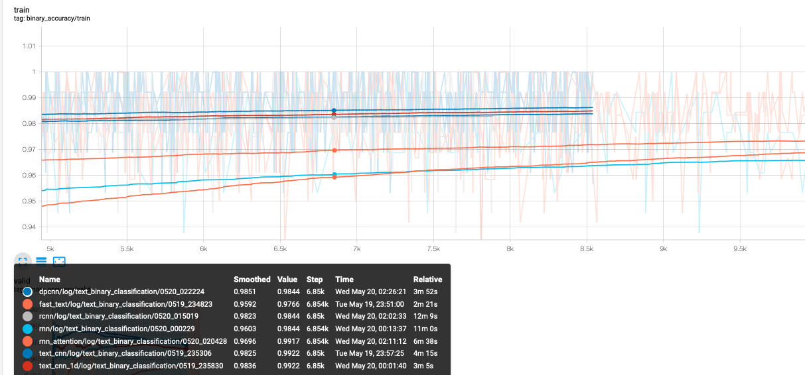

训练集上的速度：

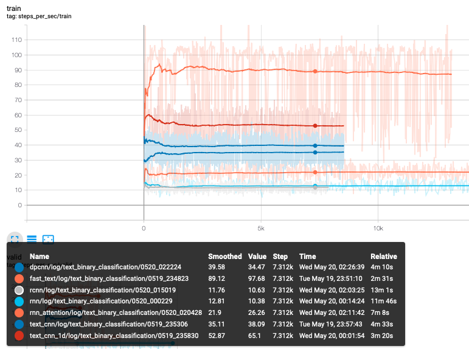

验证集上的表现：

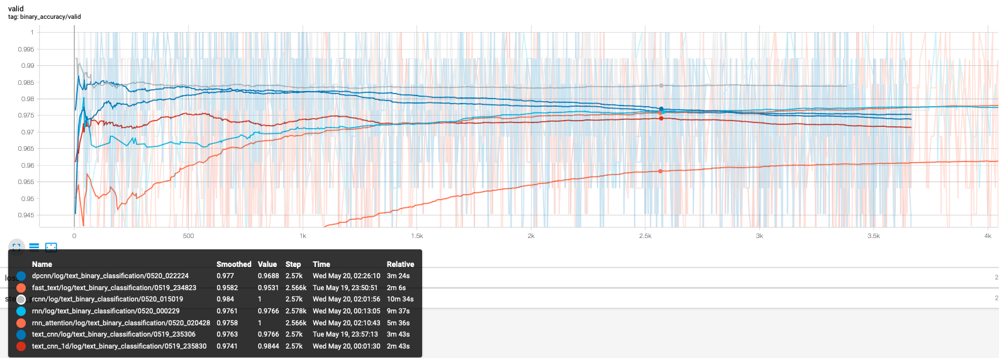

验证集上的速度

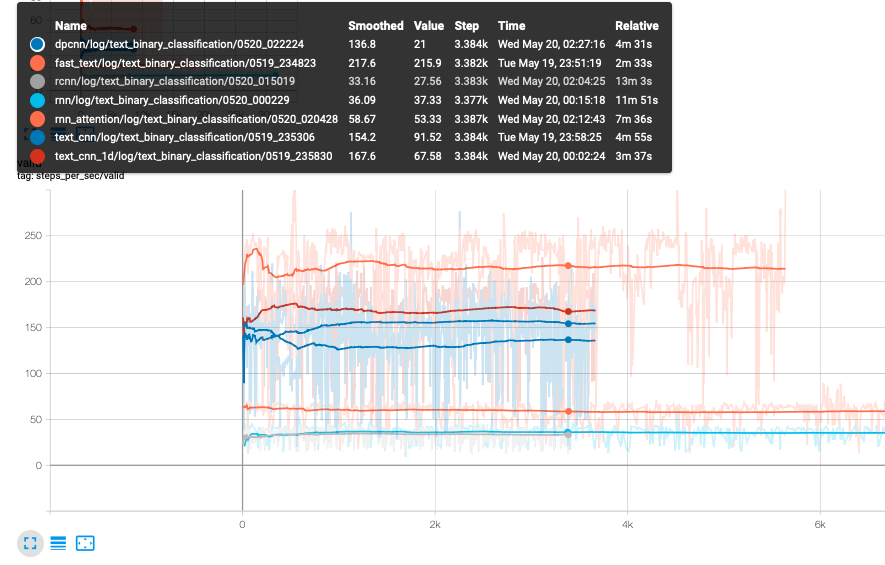

1. 从验证集上的表现来看，rcnn的表现比较稳定，0.985，但是其训练以及预测速度却是最慢的一个。FastText是速度最快的一个，在验证集上也能取得0.961的表现。可以根据任务的需求进行取舍。
2. 对于FastText 来说，embedding的训练一定要打开。
3. 对于过拟合现象，可以通过freeze word embedding 来缓解。
4. 是使用字向量还是词向量？
   * 对于FastText来说，使用词向量会比使用字向量精确度高出1%左右。原因就向上面FastText的缺点所述部分，使用词向量的时候会添加额外的`n-gram`信息。
   * 对于TextCNN来说，网络自身就能够提取`n-gram`特征，如果再使用词向量，对于短文本来说，句子信息被压缩，容易出现过拟合现象（DPCNN同样出现过拟合）。在短文本的数据集上，TextCNN还是使用字向量比较好。
   * 对于rnn来说，本身就存在梯度弥散和梯度爆炸的问题，所以使用词向量，使得句子序列会变长，会加剧这个问题。对于lstm来说也是同样的。
   * 对于rcnn来说，使用词向量还是字向量基本没有任何区别。
   * 对于加attention的rnn，每个时间步会attention到整个序列的word embedding，所以词向量或者字向量带来的影响并不明显。

#### RNN，LSTM，GRU

训练集和验证集上的表现：

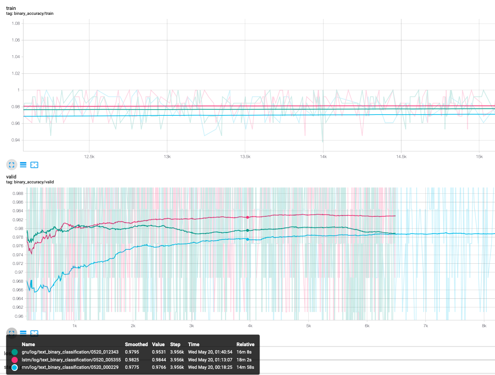

速度比较：

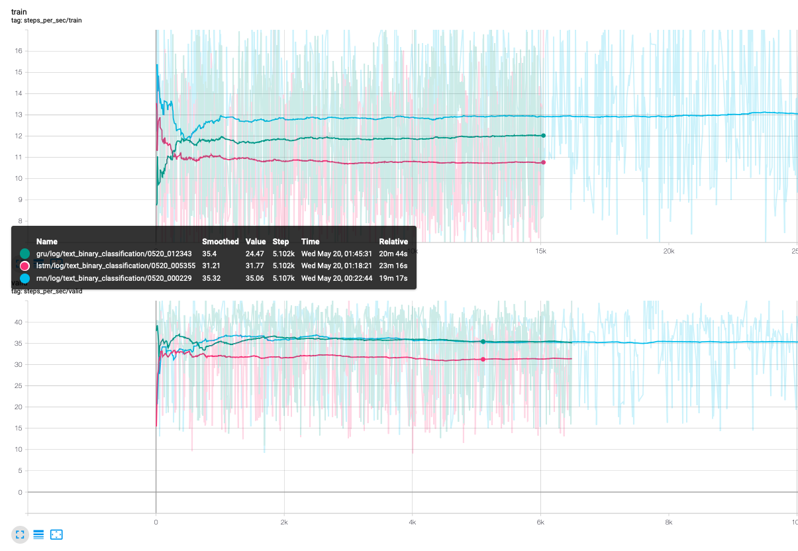

1. 速度上相差无几，能用lstm就用lstm把。
2. 不要仅仅使用rnn最后输出的hidden来做分类。（如果只使用hidden来做分类，准确度50%.）
3. 是使用sum求和来获取整句话的语义还是使用mean来获取整句话的语义其实影响不大。
4. 在rnn上使用attention 精度上会略有提升，但是相比于速度的下降，感觉有些得不偿失，如果追求精度可以加上attention。

#### Bert，BertCNN，BertRNN，BertRCNN

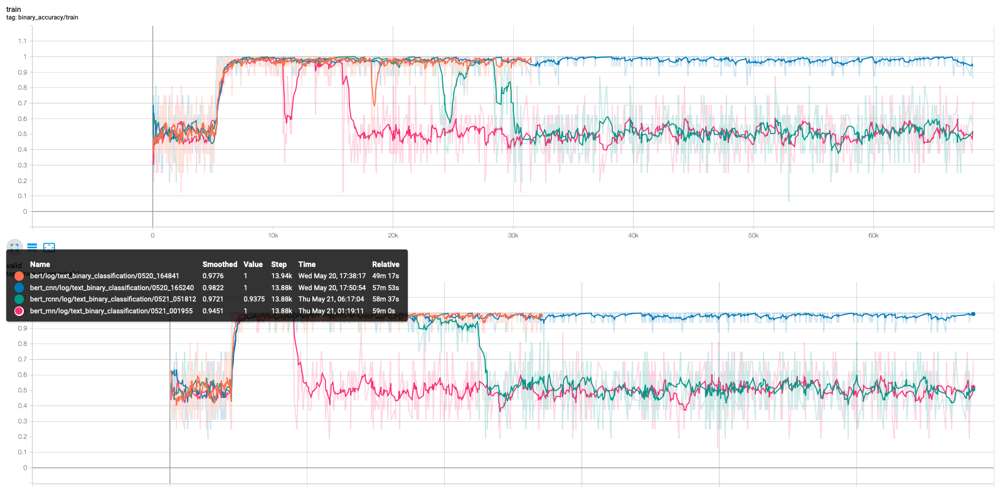


1. 通常来说bert的模型的train不用打开，如果打开，在bert后面接的层的学习率应大于bert学习率一两个数量级，使得后面的层得到充分的训练。
2. bert模型本身就可以达到98.3%左右的精确度，在后面添加其他模型看不出效果。


## Cnews新闻十分类结果比较

### 数据

类别：'体育' '娱乐' '家居' '房产' '教育' '时尚' '时政' '游戏' '科技' '财经'
训练集：50000 条数据，最大长度：27467，最小长度：8，类别个数：10,平均长度：913.31
验证集：5000 条数据，最大长度：10919，最小长度：15，类别个数：10
测试集：10000 条数据，最大长度：14720，最小长度：13，类别个数：10

使用数据集[cnews](https://pan.baidu.com/s/1OOTK374IZ1DHnz5COUcfbw)  密码:hf6o


训练集部分样例及每个类别的统计：

| label | text                                                         | 数量 |
| ----- | ------------------------------------------------------------ | ---- |
| 体育  | 黄蜂vs湖人首发：科比带伤战保罗 加索尔救赎之战 新浪体育讯北京时间4月27日，NBA季后赛首轮洛杉矶湖人主场迎战新奥尔良黄蜂，此前的比赛中，双方战成2-2平，因此本场比赛对于两支球队来说都非常重要，赛前双方也公布了首发阵容：湖人队：费舍尔、科比、阿泰斯特、加索尔、拜纳姆黄蜂队：保罗、贝里内利、阿里扎、兰德里、奥卡福[新浪NBA官方微博][新浪NBA湖人新闻动态微博][新浪NBA专题][黄蜂vs湖人图文直播室](新浪体育) | 5000 |
| 娱乐  | 皮克斯首部3D动画《飞屋历险记》预告发布(图)视频：动画片《飞屋历险记》先行版43秒预告新浪娱乐讯 迪士尼、皮克斯2009暑期3D动画力作《飞屋历险记》(Up)发布预告片，虽然这款预告片仅有43秒，并且只出现了被汽球吊起来的房屋，但门前老爷爷卡尔的一声“下午好”着实让人忍俊不禁。该片由《怪兽电力公司》导演彼特·道格特(Pete Docter)执导，曾在《海底总动员》、《料理鼠王》担任编剧的皮克斯老班底鲍勃-派特森(Bob Peterson)亦将在本片担任共同导演，献出自己的导演处女作。《飞屋历险记》同时会是皮克斯有史以来第一部以3-D电影呈现的里程碑作品，之后皮克斯的所有影片都将制作成立体电影。《飞屋历险记》讲述了一老一少的冒险旅程。78岁的老翁卡尔·弗雷德里克森(Carl Fredricksen)一生中都梦想着能环游世界、出没于异境险地体验，却平淡地渡过了一生。在他生活的最后阶段，卡而仿佛在命运的安排下，带着8岁的亚裔小鬼头Russell一同踏上了冒险的旅程。这对一老一小的奇特组合肩并肩闯荡江湖，共同经历了荒野跋涉、丛林野兽与反派坏蛋的狙击。田野/文 | 5000 |
| 家居  | 橱柜价格关键在计价方式 教你如何挑选买过橱柜的人都知道，橱柜的计价很复杂，商家的报价方式也不尽相同，那么哪种计价方式对消费者更有利？在计价过程中应该注意哪些问题？消费者在购买橱柜之前一定要了解清楚。 橱柜的主要计价方式——延米计价和单元柜体计价 现在市场上橱柜主要有两种计价方式——延米计价和单元柜体计价。 延米计价是指地柜和吊柜各一米的总价(有些还包含台面)。在此基础上，如果有局部区域只要地柜不要吊柜，就会按就会按“2/8”或“4/6”的比例折算。如某橱柜材料的延米价为2000元/延米，某顾客做2米的吊柜、4米的地柜，则吊柜价=2000X0.4X2=1600元，地柜价=2000X0.6X4=4800元(此吊柜、地柜价按4/6的比例计算)，再加上所选台面、配件、电器等附加费用即为整套橱柜的价格。 延米报价有许多不合理之处，水槽、燃气灶、嵌入式电器等部分所需门板很少，但仍按延米来算价，对消费者来说很不划算。例如一款1000元/延米的橱柜，一个水槽约0.8米长，但消费者还是要按1000元的单价乘以0.8米付费，这个实际上只是几块材料简单组合的水槽柜需要消费者花800元，而同样材质、同样大小的水槽柜仅需400元左右，二者价格相差数百元。 按延米计价，所有的配件费用都是在原有的基础上增加，虽然有些厂家宣称抽屉、拉篮不加钱，但其实那是最基本的配置，一旦顾客要求调整方案，就会要多加钱，此外不足一米的部分要按一米计价，因此对顾客来说，如此计价会多花不少冤枉钱。 “单元柜体计价”是国际惯例的橱柜计价方式，是按每一个组成厨柜的单元柜价格进行计算，然后加出总价。具体为：某吊柜单价×个数+某地柜单价×个数……。利用单元柜体计价，更为合理。举个例子说，外观相同的柜体，抽屉数量、五金件、托架数量如果不同，在以延米计价时，商家往往只给消费者最简单、最省成本的产品。而按单元柜体计价，一款尺寸相同的抽屉柜可按不同配置报出不同价格：同样是一款30cm宽、66cm高的单体柜，如果门改成弧型，是多少钱；如果抽屉里加上可拆装的金属篮，是多少钱；如果抽屉的侧板是木质的多少钱……把橱柜的每个细节都分解开来，消费者可以在预算之内把可有可无的配置省掉，把钱花在自己更需要的功能上。 两全其美报价方式——延米计价和单元柜体计价相结合 现在中国橱柜市场上仍普遍采用延米计价，但进口品牌及国内一些大品牌橱柜都采用单元柜体计价方式，如德宝·西克曼、海尔等品牌即是采用单元柜体计价方式。不过德宝·西克曼厨柜的工作人员介绍到，如果一开始就用单元柜体计价来进行报价，不够直观，同时为了便于顾客进行比较，他们会用延米计价给顾客所选定的材料进行一个初始报价，让顾客对自己的厨房装修要花多少钱心里大概有个底。在对厨房进行量尺后，设计师会按照顾客的需求，设计出厨房效果图。这时，销售人员会按单元柜体计价给顾客进行一个报价。对于每一种标准柜体都有相应的报价，顾客实际用到几组柜子，将这些柜子价格累加，再加上台面及其他相关费用，便是整个橱柜的价格。 | 5000 |
| 房产  | 冯仑：继续增持高GDP城市商业地产确立商业地产投资战略不久的万通地产(企业专区,旗下楼盘)(600246)，今年上半年遭遇了业绩下滑。公司昨日公布的半年报显示，其商业物业在报告期内实现的营业收入同比下降33.71%，营业利润率比上年同期下降47.29个百分点。不过，公司董事长冯仑日前表示，依然看好人均GDP8000美元以上城市的商业地产，万通将继续增加高GDP城市的商业地产；计划用5-10年，商业物业收入占比达到30%-50%。逆向运作地产投资冯仑指出，根据历史经验，GDP的增长、城市化的增长，和房地产物业形态有一定关系，即人均GDP在8000美元以下时，住宅是市场的核心，主流产品都将围绕住宅展开。目前，在中国的城市中，人均GDP8000美元的城市大约有十个，大部分省会城市依然在3000美元至5000美元之间，因此，未来5-10年，中国房地产市场的产品结构仍然是以住宅为主。 冯仑认为，万通地产从现在开始扩大商业地产的比重，在目前的市场中，是一种逆向运作的思维，但符合长期趋势。他指出，在人均GDP达到8000美元的经济实体中，商用不动产会成为地产业的主角。以美国为例，商业地产的市场规模大约是住宅的两倍。中国商业地产未来的市场空间很大。根据万通地产的发展战略，除了在环渤海区域内发展住宅以外，还会重点发展商业不动产。未来，公司业务结构将逐步调整，商用地产的收入会逐年增加；今后，公司商业物业收入将占到整体营业收入的一半左右。对于目前商业地产面临的不景气局面，万通地产董事会秘书程晓?指出，公司战略不会因市场的短期波动而改变，公司将继续加大商用物业项目的投资力度，以营运带动开发，以财务安排的多样化实施商用物业投资。改变商业模式冯仑表示，就房地产开发模式而言，过去两百年主要经历了三次变化，即从“地主加工头”到“厂长加资本家”，再到“导演加制片”。目前，国内多数地产商的开发模式属于“地主加工头”和“厂长加资本家”的阶段；而商业地产的开发模式，不能停留在这两个阶段。所谓“导演加制片”模式，即由专业的房地产投资和资产管理公司负责运营商业地产项目，实现收入的多元化。而这种模式需要相应的金融创新产品支持。业内人士指出，房地产金融领域内的REITS、抵押贷款等金融产品体系的完善，将支持商用地产在一个多元化的不动产经营环境中快速的成长。而商业模式的改变需要较长一段时间。数据显示，香港主流房地产企业在人均GDP10000美元的时候开始逐步发展商业地产，先后经过13-15年确立起新的商业模式。其中，长江实业经过13年的发展，商业地产在业务机构的比重占到30%，新鸿基则经过15年的调整，商业地产比重占到50%。SOHO中国(企业专区,旗下楼盘)董事长潘石屹也指出，现在的市场虽然在调整，不过也给从事商业地产开发的企业提供了良好机会和平台，应及时在地域、开发物业的品种、品牌的建设、销售和持有物业的比重四个方面做出调整。 我要评论 | 5000 |
| 教育  | 2010年6月英语六级考试考后难度调查2010年6月大学英语六级考试将于19日下午举行，欢迎各位考生在考试后参加难度调查，发表你对这次考试的看法。点击进入论坛，参与考后大讨论 | 5000 |
| 时尚  | 组图：萝莉潮人示范春季复古实穿导语：萝莉潮人示范春季复古实穿，在乍暖还寒的初春，有的甜美、有的优雅、有的性感，但无论是哪种风格都给人强烈的视觉冲击力，在这个缤纷的春季更加脱俗动人。 | 5000 |
| 时政  | 香港特区行政长官曾荫权将离港休假中新社香港八月七日电 香港特区行政长官曾荫权将于八月九日至十五日离港休假。特区政府发言人七日透露，曾荫权离港期间，八月九日由特区财政司司长曾俊华署理行政长官职务；八月十日至十五日由政务司司长唐英年署理行政长官职务。(完) | 5000 |
| 游戏  | 全国人大常委会将对59件法律相关条文作出修改新华社快讯：全国人大常委会27日表决通过了关于修改部分法律的决定，对59件法律的相关条文作出修改。 | 5000 |
| 科技  | 入门级时尚卡片机 尼康S220套装仅1150尼康S220延续了S系列纤巧超薄的机身设计，采用铝合金材质打造，表面质地细腻，不易沾染指纹。S220拥有紫色、深蓝、洋红、水晶绿和柔银五款靓丽颜色可供选择。 | 5000 |

### 分析比较

 训练集上的表现（字向量）（序列长度：2000）：

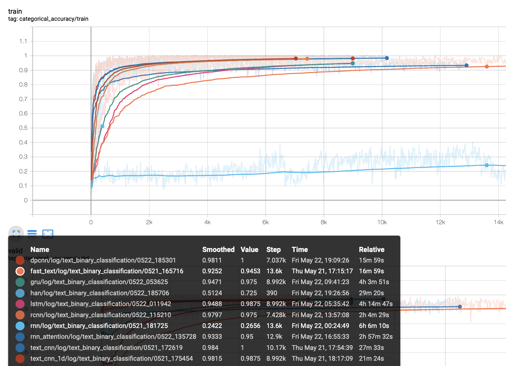


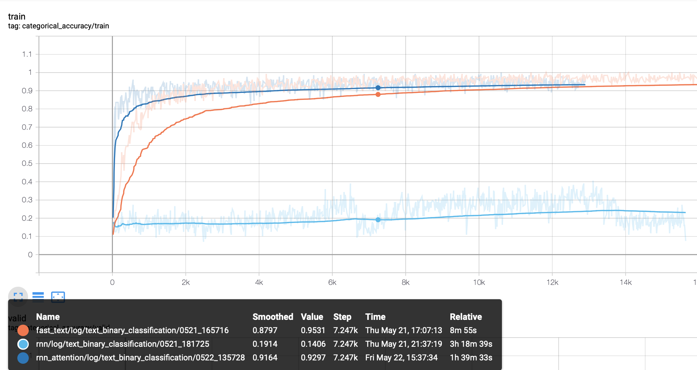


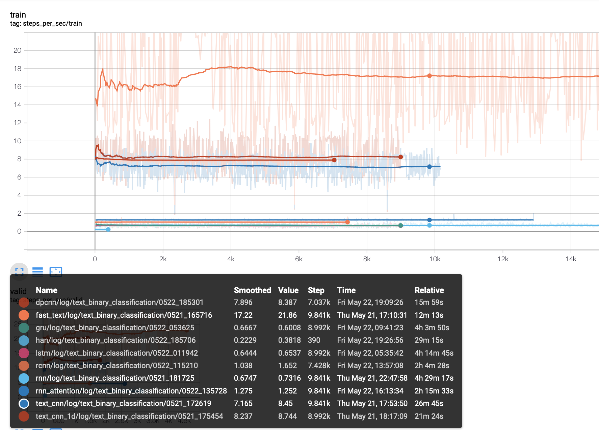

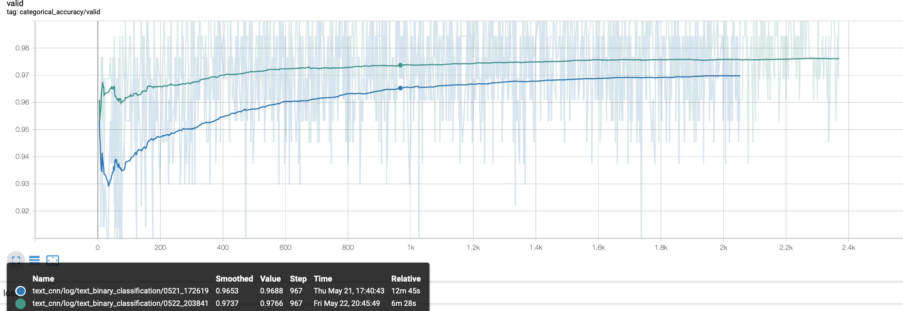


1. rnn在面对长文本时直接崩溃了（感觉自己说了一个废话）。再给rnn加上attention之后，rnn得到了救赎，但是效果和FastText基本持平。由此推断lstm+attention 能够获得一个相对较好的结果（如果不考虑速度的话）。
2. 从speed图来看，最快的当然是FastText，可以并行的CNN处于第二梯队，最后的是RNN系列的模型。
3. 词向量还是字向量：
   1. 对于FastText来说，在长文本上，词向量的表现要远远好于字向量。
   2. 可能是文本长度过长了吧，实验结果表明：在长文本数据上，词向量的表现要好于字向量，对于长文本分类来说，整句话的语义要高于某些特定的词吧。
   3. 对于rnn系列来说，毫无疑问，词向量的表现远好于字向量，因为句子序列长度变短了。
   4. rcnn模型一般来说不会比rnn，或者cnn表现差。
4. xlnet由于显存的原因，序列长度只取到1500（只要你显存够，在一定意义上来说是解决了bert的长度限制的问题）。但是在11g单卡上，batch_size=2，跑完一步，FastText可以跑一个epoch。不知道知识蒸馏效果会怎样。


## 文本多标签分类

（先挖一个坑）

## 分析

#### 长短文本分类的比较

对于词嵌入技术的文本表示，短文本和长文本表示上没有差别，此时分类效果的优劣主要在分类模型和训练数据上。

对于数据而言：随着文本越长，语义的重要性就越高，在文本很短的情况下，语义的重要性就很小，比如：“今天 天气 怎么样”，“今天 怎么样 天气”，“怎么样 天气 今天”。你甚至不必要考虑句子是否通顺，基本上可以当一句话处理，没有第二个意思。但是随着文本越来越长，比如512个字符，颠倒一下可能就要归为两类了。

对于模型而言：对于短文本，CNN配合Max-pooling池化(如TextCNN模型)速度快，而且效果也很好。因为短文本上的关键词比较容易找到，而且Max-pooling会直接过滤掉模型认为不重要特征。具体工作机制是：卷积窗口沿着长度为n的文本一个个滑动，类似于n-gram机制对文本切词，然后和文本中的每个词进行相似度计算，因为后面接了个Max-pooling，因此只会保留和卷积核最相近的词。微博数据集属于情感分类，为了判断句子的情感极性，只需要让分类器能识别出“不开心”这类词是个负极性的词，“高兴”、“开心”等这类词是正极性的词，其他词是偏中性词就可以了。因此，当把该句子中的各个词条输入给模型去分类时，并不需要去“瞻前顾后”，因此使用一个关注局部的前馈神经网络往往表现更佳。虽然Attention也突出了重点特征，但是难以过滤掉所有低分特征。但是对于长文本直接用CNN就不行了，TextCNN会比HAN模型泛化能力差很多。**如果在TextCNN前加一层LSTM，这样效果可以提升很大**。

#### 为什么长文本分类的实验中，cnn 和 rnn 没有拉开差距？

cnn和rnn的精度都很高，分析主要还是分类的文章规则性比较强，且属于特定领域，词量不多，类别差异可能比较明显。


# 文本分类tricks

## 分词器

**分词器所分出的词与词向量表中的token粒度match是更重要的事情**

## 已知预训练词向量的分词器

像word2vec、glove、fasttext这些官方release的预训练词向量都会公布相应训练语料的信息，包括预处理策略如分词，这种情况下直接使用官方的训练该词向量所使用的分词器，此分词器在下游任务的表现十之八九会比其他花里胡哨的分词器好用。

## 不知道预训练词向量的分词器

这时就需要去“猜”一下分词器。怎么猜呢？
首先，拿到预训练词向量表后，去里面search一些特定词汇比如一些网站、邮箱、成语、人名等，英文里还有n't等，看看训练词向量使用的分词器是把它们分成什么粒度。
然后跑几个分词器，看看哪个分词器的粒度跟他最接近就用哪个，如果不放心，就放到下游任务里跑跑看。

最理想的情况是：先确定最适合当前任务数据集的分词器，再使用同分词器产出的预训练词向量。如果无法满足理想情况，则需要自己在下游任务训练集或者大量同分布无监督语料上训练的词向量更有利于进一步压榨模型的性能。

## 关于中文字向量

预训练中文字向量的时候，把窗口开大一些，不要直接使用word-level的窗口大小，效果会比随机初始化的字向量明显的好。

## 数据集噪声很严重

里噪声严重有两种情况。对于数据集D(X, Y)，一种是X内部噪声很大（比如文本为口语化表述或由互联网用户生成），一种是Y的噪声很大（一些样本被明显的错误标注，一些样本人也很难定义是属于哪一类，甚至具备类别二义性）。

## X内部噪声很大

法一：直接将模型的输入变成char-level（中文中就是字的粒度），然后train from scratch（不使用预训练词向量）去跟word-level的对比一下，如果char-level的明显的效果好，那么短时间之内就直接基于char-level去做模型。

法二：使用特殊超参的FastText去训练一份词向量：
一般来说fasttext在英文中的char ngram的窗口大小一般取值3～6，但是在处理中文时，如果我们的目的是为了去除输入中的噪声，那么我们可以把这个窗口限制为1～2，这种小窗口有利于模型去捕获错别字（比如，我们打一个错误词的时候，一般都是将其中的一个字达成同音异形的另一个字），比如word2vec学出来的“似乎”的最近词可能是“好像”，然而小ngram窗口fasttext学出来的“似乎”最近词则很有可能是“是乎”等内部包含错别字的词，这样就一下子让不太过分的错别字构成的词们又重新回到了一起，甚至可以一定程度上对抗分词器产生的噪声（把一个词切分成多个字）。

## Y的噪声很大

首先忽略这个噪声，强行的把模型尽可能好的训出来。然后让训练好的模型去跑训练集和开发集，取出训练集中的错误样本和开发集中那些以很高的置信度做出错误决策的样本（比如以99%的把握把一个标签为0的样本预测为1），然后去做这些bad cases的分析，如果发现错误标注有很强的规律性，则直接撸一个脚本批量纠正一下（只要确保纠正后的标注正确率比纠正前明显高就行）。
如果没有什么规律，但是发现模型高置信度做错的这些样本大部分都是标注错误的话，就直接把这些样本都删掉，常常也可以换来性能的小幅提升，毕竟测试集都是人工标注的，困难样本和错标样本不会太多。

## baseline选用CNN还是RNN？

看数据集，如果感觉数据集里很多很强的ngram可以直接帮助生成正确决策，那就CNN。
如果感觉很多case都是那种需要把一个句子看完甚至看两三遍才容易得出正确tag，那就RNN。
还可以CNN、RNN的模型都跑出来简单集成一下。

## Dropout加在哪里

word embedding层后、pooling层后、FC层（全联接层）后。

## 二分类

二分类问题不一定要用sigmoid作为输出层的激活函数，尝试一下包含俩类别的softmax。可能多一条分支就多一点信息，实践中常常带来零点几个点的提升。

## 样本类别不均衡问题

如果正负样本比小于9:1的话，继续做深度模型调超参，决策阈值也完全不用手调。但是，如果经常一个batch中完全就是同一个类别的样本，或者一些类别的样本经过好多batch都难遇到一个的话，均衡就非常非常有必要了。

## 最后

1. 别太纠结文本截断长度使用120还是150
2. 别太纠结对性能不敏感的超参数带来的开发集性能的微小提升
3. 别太纠结未登陆词的embedding是初始化成全0还是随机初始化，别跟PAD共享embedding就行
4. 别太纠结优化器用Adam还是MomentumSGD，如果跟SGD的感情还不深，无脑Adam，最后再用MomentumSGD跑几遍
5. 还是不会用tricks但是就是想跑出个好结果，bert大力出奇迹。

# 总结

复杂的模型未必会有很好的结果，简单模型效果未必不理想，没必要一味追求深度学习、复杂模型什么的。选什么样的模型还是要根据数据来的。同一类问题，不同的数据效果差异很大，不要小看任何一类问题，例如分类，我们通常觉得它很简单，但有些数据并非你所想。

ps:
  很高兴这份代码能帮助到一些小伙伴，有小伙伴反映，代码缺少inference部分，所以补上一份inference代码，供需要的小伙伴参考。


# 参考

1. [fastText原理和文本分类实战，看这一篇就够了](https://blog.csdn.net/feilong_csdn/article/details/88655927)
2. [TextCNN文本分类（keras实现）](https://blog.csdn.net/asialee_bird/article/details/88813385#一、论文笔记)
3. [浅谈基于深度学习的文本分类问题](https://zhuanlan.zhihu.com/p/55263066)
4. [从DPCNN出发，撩一下深层word-level文本分类模型](https://www.jiqizhixin.com/articles/2018-06-22-4)
5. [文本分类有哪些论文中很少提及却对性能有重要影响的tricks？](https://www.jiqizhixin.com/articles/2019-01-24-5)
6. [从前馈到反馈：解析循环神经网络（RNN）及其tricks](https://mp.weixin.qq.com/s?__biz=MzIwNzc2NTk0NQ==&mid=2247484682&idx=1&sn=51520138eed826ec891ac8154ee550f9&chksm=970c2ddca07ba4ca33ee14542cff0457601bb16236f8edc1ff0e617051d1f063354dda0f8893&scene=21#wechat_redirect)
7. [[达观数据曾彦能：如何用深度学习做好长文本分类与法律文书智能化处理](http://www.52nlp.cn/如何用深度学习做好长文本分类与法律文书智能化)](http://www.52nlp.cn/tag/长文本分类)
8. [短文本分类和长文本分类的模型如何进行选择？](https://www.zhihu.com/question/326770917/answer/698646465)
9. [NLP实践九：HAN原理与文本分类实践](https://www.pianshen.com/article/4319299677/)
10. [NLP之文本分类](https://www.jianshu.com/p/56061b8f463a)

