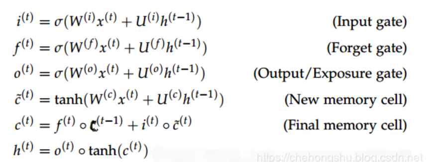
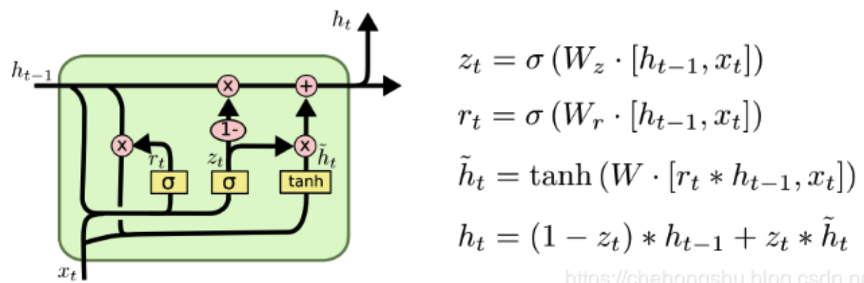
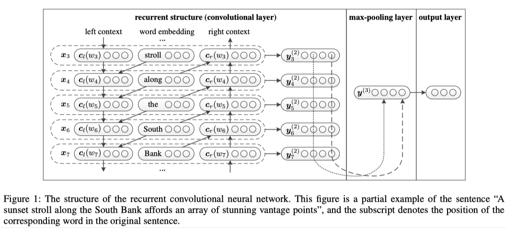
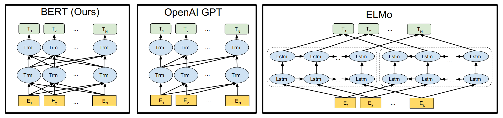

如果图片格式出现错误，移步[github.io](https://jeffery0628.github.io/2020/03/29/文本分类模型及比较/#more)

[文本多分类/长文本分类](https://github.com/jeffery0628/text_multi_classification)
### 使用
所有模型都可直接使用，切换模型：修改trian.py文件下的config为对应模型的config.json文件。

### 数据集

weibo_senti_100k：共119988条数据，正例：59993,负例59995   

句子最大长度：260，最小长度：3，平均长度：66.04

部分样例

| label | review                                                       |
| ----- | ------------------------------------------------------------ |
| 1     | 更博了，爆照了，帅的呀，就是越来越爱你！生快傻缺[爱你][爱你][爱你] |
| 1     | @张晓鹏jonathan 土耳其的事要认真对待[哈哈]，否则直接开除。@丁丁看世界 很是细心，酒店都全部OK啦。 |
| 1     | 姑娘都羡慕你呢…还有招财猫高兴……//@爱在蔓延-JC:[哈哈]小学徒一枚，等着明天见您呢//@李欣芸SharonLee:大佬范儿[书呆子] |
| 1     | 美~~~~~[爱你]                                                |
| 1     | 梦想有多大，舞台就有多大![鼓掌]                              |
| 0     | 今天真冷啊，难道又要穿棉袄了[晕]？今年的春天真的是百变莫测啊[抓狂] |
| 0     | [衰][衰][衰]像给剥了皮的蛇                                   |
| 0     | 酒驾的危害，这回是潜水艇。//@上海译文丁丽洁:[泪]             |
| 0     | 积压了这么多的枕边书，没一本看完了的，现在我读书的最佳地点尽然是公交车[晕] |
| 0     | [泪]错过了……                                                 |

[词向量下载](https://github.com/Embedding/Chinese-Word-Vectors)

[中文预训练bert模型下载](https://github.com/ymcui/Chinese-BERT-wwm)

<!--more-->

### 数据处理代码

#### DataSet

#### dataloader

#### Vocab属性：

1. freqs
2. itos
3. stoi
4. vectors

#### Bert Dataprocess

### FastText

#### 简介

fastText是Facebook于2016年开源的一个词向量计算和文本分类工具。在文本分类任务中，fastText（浅层网络）往往能取得和深度网络相媲美的精度，却在训练时间上比深度网络快许多数量级。在标准的多核CPU上， 在10分钟之内能够训练10亿词级别语料库的词向量，在1分钟之内能够分类有着30万多类别的50多万句子。

fastText是一个快速文本分类算法，与基于神经网络的分类算法相比有两大优点：
1、fastText在保持高精度的情况下加快了训练速度和测试速度
2、fastText不需要预训练好的词向量，fastText会自己训练词向量
3、fastText两个重要的优化：Hierarchical Softmax、N-gram

#### fastText模型架构

fastText模型架构和word2vec中的CBOW很相似， 不同之处是fastText预测标签而CBOW预测的是中间词，即模型架构类似但是模型的任务不同。下面我们先看一下CBOW的架构：


word2vec将上下文关系转化为多分类任务，进而训练逻辑回归模型，这里的类别数量|V|词库大小。通常的文本数据中，词库少则数万，多则百万，在训练中直接训练多分类逻辑回归并不现实。word2vec中提供了两种针对大规模多分类问题的优化手段， negative sampling 和hierarchical softmax。在优化中，negative sampling 只更新少量负面类，从而减轻了计算量。hierarchical softmax 将词库表示成前缀树，从树根到叶子的路径可以表示为一系列二分类器，一次多分类计算的复杂度从|V|降低到了树的高度
fastText模型架构:其中x1,x2,…,xN−1,xN表示一个文本中的n-gram向量，每个特征是词向量的平均值。这和前文中提到的cbow相似，cbow用上下文去预测中心词，而此处用全部的n-gram去预测指定类别


#### 模型代码

```python
class FastText(BaseModel):
    def __init__(self, vocab, embedding_dim, output_dim, use_pretrain_embedding=False):
        super().__init__()
        self.embedding_dim = embedding_dim
        if use_pretrain_embedding:
            self.embedding = nn.Embedding.from_pretrained(vocab.vectors)
        else:
            self.embedding = nn.Embedding(len(vocab), embedding_dim, padding_idx=vocab.pad_index)
        # 把unknown 和 pad 向量设置为零
        self.embedding.weight.data[vocab.unk_index] = torch.zeros(embedding_dim)
        self.embedding.weight.data[vocab.pad_index] = torch.zeros(embedding_dim)

        self.fc = nn.Linear(embedding_dim, output_dim)

    def forward(self, text,text_lengths):
        # text = [sent len, batch size]

        embedded = self.embedding(text)

        # embedded = [sent len, batch size, emb dim]

        embedded = embedded.permute(1, 0, 2)

        # embedded = [batch size, sent len, emb dim]

        pooled = F.avg_pool2d(embedded, (embedded.shape[1], 1)).squeeze(1)

        # pooled = [batch size, embedding_dim]

        return self.fc(pooled)

```


### TextCNN
#### 简介

**Yoon Kim**在论文[(2014 EMNLP) Convolutional Neural Networks for Sentence Classification](https://arxiv.org/abs/1408.5882)提出TextCNN。

将**卷积神经网络CNN**应用到**文本分类**任务，利用**多个不同size的kernel**来提取句子中的关键信息（类似于多窗口大小的ngram），从而能够更好地捕捉局部相关性。

#### 网络结构


#### 原理

TextCNN的详细过程原理图如下：


TextCNN详细过程：

- **Embedding**：第一层是图中最左边的7乘5的句子矩阵，每行是词向量，维度=5，这个可以类比为图像中的原始像素点。
- **Convolution**：然后经过 kernel_sizes=(2,3,4) 的一维卷积层，每个kernel_size 有两个输出 channel。
- **MaxPolling**：第三层是一个1-max pooling层，这样不同长度句子经过pooling层之后都能变成定长的表示。
- **FullConnection and Softmax**：最后接一层全连接的 softmax 层，输出每个类别的概率。

 通道（Channels）：

- 图像中可以利用 (R, G, B) 作为不同channel；
- 文本的输入的channel通常是不同方式的embedding方式（比如 word2vec或Glove），实践中也有利用静态词向量和fine-tunning词向量作为不同channel的做法。

一维卷积（conv-1d）：

- 图像是二维数据；
- **文本是一维数据，因此在TextCNN卷积用的是一维卷积**（在**word-level**上是一维卷积；虽然文本经过词向量表达后是二维数据，但是在embedding-level上的二维卷积没有意义）。一维卷积带来的问题是需要**通过设计不同 kernel_size 的 filter 获取不同宽度的视野**。

#### 代码

```python

class TextCNN(nn.Module):
    def __init__(self, vocab, embedding_dim, n_filters, filter_sizes, output_dim,
                 dropout, use_pretrain_embedding=False):
        super().__init__()
        self.embedding_dim = embedding_dim
        if use_pretrain_embedding:
            self.embedding = nn.Embedding.from_pretrained(vocab.vectors)
        else:
            self.embedding = nn.Embedding(len(vocab), embedding_dim, padding_idx=vocab.pad_index)
        # 把unknown 和 pad 向量设置为零
        self.embedding.weight.data[vocab.unk_index] = torch.zeros(embedding_dim)
        self.embedding.weight.data[vocab.pad_index] = torch.zeros(embedding_dim)

        self.convs = nn.ModuleList([
            nn.Conv2d(in_channels=1,
                      out_channels=n_filters,
                      kernel_size=(fs, embedding_dim))
            for fs in filter_sizes
        ])

        self.fc = nn.Linear(len(filter_sizes) * n_filters, output_dim)

        self.dropout = nn.Dropout(dropout)

    def forward(self, text,text_lengths):
        # text = [batch size, sent len]

        embedded = self.embedding(text)

        # embedded = [batch size, sent len, emb dim]

        embedded = embedded.unsqueeze(1)

        # embedded = [batch size, 1, sent len, emb dim]

        conved = [F.relu(conv(embedded)).squeeze(3) for conv in self.convs]

        # conved_n = [batch size, n_filters, sent len - filter_sizes[n] + 1]

        pooled = [F.max_pool1d(conv, conv.shape[2]).squeeze(2) for conv in conved]

        # pooled_n = [batch size, n_filters]

        cat = self.dropout(torch.cat(pooled, dim=1))

        # cat = [batch size, n_filters * len(filter_sizes)]

        return self.fc(cat)
```

 

### RNN系列

通过将前一时刻的运算结果添加到当前的运算中，从而实现了“考虑上文信息”的功能。


RNN可以考虑上文的信息，那么如何将下文的信息也添加进去呢？这就是BiRNN要做的事情。


#### LSTM

因为RNN存在梯度弥散和梯度爆炸的问题，所以RNN很难完美地处理具有长期依赖的信息。既然仅仅依靠一条线连接后面的神经元不足以解决问题，那么就再加一条线好了，这就是LSTM。

LSTM的关键在于细胞的状态和穿过细胞的线，细胞状态类似于传送带。直接在整个链上运行，只有一些少量的线性交互。信息在上面流动保持不变会变得容易。


在LSTM中，门可以实现选择性的让信息通过，主要通过一个sigmoid的神经层和一个逐点相乘的操作来实现。LSTM通过三个这样的门结构来实现信息的保护和控制，分别是遗忘门（forget gate）、输入门（input gate）与输出门（output gate）。

##### **遗忘门**

在LSTM中的第一步是决定从细胞状态中丢弃什么信息。这个决定通过一个称为遗忘门的结构来完成。遗忘门会读取$h_{t-1}$和$x_t$，输出一个0到1之间的数值给细胞的状态$c_{t-1}$中的数字。1表示完全保留，0表示完全舍弃。


##### **输入门**

遗忘门决定让多少新的信息加入到cell的状态中来。实现这个需要两个步骤：

1. 首先一个叫“input gate layer”的sigmoid层决定哪些信息需要更新；一个tanh层生成一个向量，用来更新状态C。

   

2. 把 1 中的两部分联合起来，对cell的状态进行更新，我们把旧的状态与$f_t$相乘，丢弃掉我们确定需要丢弃的信息，接着加上$i_t * \tilde{C}_{t}$

##### 输出门

最终，我们需要确定输出什么值，这个输出将会基于我们的细胞的状态，但是也是一个过滤后的版本。首先，我们通过一个sigmoid层来确定细胞状态的哪些部分将输出出去。接着，我们把细胞状态通过tanh进行处理（得到一个-1到1之间的值）并将它和sigmoid门的输出相乘，最终我们仅仅会输出我们确定输出的部分。


##### 公式



#### GRU

在LSTM中引入了三个门函数：输入门、遗忘门和输出门来控制输入值、记忆值和输出值。而在GRU模型中只有两个门：分别是更新门和重置门。



图中的$z_t$和$r_t$分别表示更新门和重置门。更新门用于控制前一时刻的状态信息被带入到当前状态中的程度，更新门的值越大说明前一时刻的状态信息带入越多。重置门控制前一状态有多少信息被写入到当前的候选集 $\tilde{h}_{t}$上，重置门越小，前一状态的信息被写入的越少。

LSTM和CRU都是通过各种门函数来将重要特征保留下来，这样就保证了在long-term传播的时候也不会丢失。此外GRU相对于LSTM少了一个门函数，因此在参数的数量上也是要少于LSTM的，所以整体上GRU的训练速度要快于LSTM的。

#### Self-Attention


1. Encode所有输入序列,得到对应的$h_1,h_2, \cdots ,h_T$(T为输入序列长度)
2. Decode输出目标$y_t$之前，会将上一步输出的隐藏状态$S_{t-1}$与之前encode好的$h_1,h_2,\cdots,h_T$进行比对，计算相似度（$e_{t,j}=a(s_{t-1},h_j)$）,$h_j$为之前第j个输入encode得到的隐藏向量，a为任意一种计算相似度的方式
3. 然后通过softmax，即$a_{t,j}=\frac{exp(e_{t,j})}{\sum^{T_x}_{k=1}exp(e_{t,k})}$将之前得到的各个部分的相关系数进行归一化，得到$a_{t,1},a_{t,2},\cdots,a_{t,T}$
4. 在对输入序列的隐藏层进行相关性加权求和得到此时decode需要的context vector ：$

```python
class RnnModel(BaseModel):
    def __init__(self, rnn_type, vocab, embedding_dim, hidden_dim, output_dim, n_layers,
                 bidirectional, dropout, batch_first=False,use_pretrain_embedding=False):
        super().__init__()
        self.rnn_type = rnn_type.lower()
        self.bidirectional = bidirectional
        self.hidden_dim = hidden_dim
        self.n_layers = n_layers
        self.embedding_dim = embedding_dim
        if use_pretrain_embedding:
            self.embedding = nn.Embedding.from_pretrained(vocab.vectors)
        else:
            self.embedding = nn.Embedding(len(vocab), embedding_dim, padding_idx=vocab.pad_index)
        # 把unknown 和 pad 向量设置为零
        self.embedding.weight.data[vocab.unk_index] = torch.zeros(embedding_dim)
        self.embedding.weight.data[vocab.pad_index] = torch.zeros(embedding_dim)

        if rnn_type == 'lstm':
            self.rnn = nn.LSTM(embedding_dim,
                               hidden_dim,
                               num_layers=n_layers,
                               bidirectional=bidirectional,
                               batch_first=batch_first,
                               dropout=dropout)
        elif rnn_type == 'gru':
            self.rnn = nn.GRU(embedding_dim,
                              hidden_size=hidden_dim,
                              num_layers=n_layers,
                              bidirectional=bidirectional,
                              batch_first=batch_first,
                              dropout=dropout)
        else:
            self.rnn = nn.RNN(embedding_dim,
                              hidden_size=hidden_dim,
                              num_layers=n_layers,
                              bidirectional=bidirectional,
                              batch_first=batch_first,
                              dropout=dropout)

        self.fc = nn.Linear(hidden_dim * n_layers, output_dim)

        self.dropout = nn.Dropout(dropout)
        self.batch_first = batch_first

    def forward(self, text, text_lengths):
        # text = [sent len, batch size]

        embedded = self.dropout(self.embedding(text))

        # embedded = [sent len, batch size, emb dim]

        # pack sequence
        packed_embedded = nn.utils.rnn.pack_padded_sequence(embedded, text_lengths, batch_first=self.batch_first)

        if self.rnn_type in ['rnn', 'gru']:
            packed_output, hidden = self.rnn(packed_embedded)
        else:
            packed_output, (hidden, cell) = self.rnn(packed_embedded)

        # unpack sequence
        output, output_lengths = nn.utils.rnn.pad_packed_sequence(packed_output, batch_first=self.batch_first)

        if not self.bidirectional:
            hidden = torch.reshape(hidden,(hidden.shape[1],self.hidden_dim * self.n_layers))
        else:
            hidden = torch.reshape(hidden, (-1,hidden.shape[1], self.hidden_dim * self.n_layers))
            hidden = torch.mean(hidden,dim=0)
        output = torch.sum(output,dim=0)
        fc_input = self.dropout(output+hidden)
        out = self.fc(fc_input)

        return out
```

#### Rnn-Attenton

```python
class RnnAttentionModel(BaseModel):
    def __init__(self, rnn_type, vocab, embedding_dim, hidden_dim, output_dim, n_layers,
                 bidirectional, dropout, batch_first=False,use_pretrain_embedding=False):
        super().__init__()
        self.rnn_type = rnn_type.lower()
        self.bidirectional = bidirectional
        self.hidden_dim = hidden_dim
        self.n_layers = n_layers
        self.embedding_dim = embedding_dim
        self.batch_first = batch_first

        if use_pretrain_embedding:
            self.embedding = nn.Embedding.from_pretrained(vocab.vectors)
        else:
            self.embedding = nn.Embedding(len(vocab), embedding_dim, padding_idx=vocab.pad_index)
        # 把unknown 和 pad 向量设置为零
        self.embedding.weight.data[vocab.unk_index] = torch.zeros(embedding_dim)
        self.embedding.weight.data[vocab.pad_index] = torch.zeros(embedding_dim)

        if rnn_type == 'lstm':
            self.rnn = nn.LSTM(embedding_dim,
                               hidden_dim,
                               num_layers=n_layers,
                               bidirectional=bidirectional,
                               batch_first=batch_first,
                               dropout=dropout)
        elif rnn_type == 'gru':
            self.rnn = nn.GRU(embedding_dim,
                              hidden_size=hidden_dim,
                              num_layers=n_layers,
                              bidirectional=bidirectional,
                              batch_first=batch_first,
                              dropout=dropout)
        else:
            self.rnn = nn.RNN(embedding_dim,
                              hidden_size=hidden_dim,
                              num_layers=n_layers,
                              bidirectional=bidirectional,
                              batch_first=batch_first,
                              dropout=dropout)


        self.tanh1 = nn.Tanh()
        self.tanh2 = nn.Tanh()
        # self.u = nn.Parameter(torch.Tensor(self.hidden_dim * 2,self.hidden_dim*2))
        self.w = nn.Parameter(torch.randn(hidden_dim),requires_grad=True)

        self.dropout = nn.Dropout(dropout)
        if bidirectional:
            self.w = nn.Parameter(torch.randn(hidden_dim * 2), requires_grad=True)
            self.fc = nn.Linear(hidden_dim * 2, output_dim)
        else:
            self.w = nn.Parameter(torch.randn(hidden_dim), requires_grad=True)
            self.fc = nn.Linear(hidden_dim, output_dim)

    def forward(self, text, text_lengths):
        # text = [sent len, batch size]

        embedded = self.dropout(self.embedding(text))

        # embedded = [sent len, batch size, emb dim]

        # pack sequence
        packed_embedded = nn.utils.rnn.pack_padded_sequence(embedded, text_lengths, batch_first=self.batch_first)

        if self.rnn_type in ['rnn', 'gru']:
            packed_output, hidden = self.rnn(packed_embedded)
        else:
            packed_output, (hidden, cell) = self.rnn(packed_embedded)

        # unpack sequence
        # output = [sent len, batch size, hidden dim * num_direction]
        output, output_lengths = nn.utils.rnn.pad_packed_sequence(packed_output, batch_first=self.batch_first)

        # attention
        # M = [sent len, batch size, hidden dim * num_direction]
        # M = self.tanh1(output)

        alpha = F.softmax(torch.matmul(self.tanh1(output), self.w), dim=0).unsqueeze(-1) # dim=0表示针对文本中的每个词的输出softmax
        output_attention = output * alpha

        # hidden = [n_layers * num_direction,batch_size, hidden_dim]
        if self.bidirectional:
            hidden = torch.mean(torch.reshape(hidden, (-1,hidden.shape[1], self.hidden_dim * 2)),dim=0)  # hidden = [batch_size, hidden_dim * num_direction]
        else:
            hidden = torch.mean(torch.reshape(hidden, (-1, hidden.shape[1], self.hidden_dim)), dim=0)   # hidden = [batch_size, hidden_dim]

        output_attention = torch.sum(output_attention,dim=0)
        output = torch.sum(output,dim=0)


        fc_input = self.dropout(output+output_attention+hidden)
        # fc_input = self.dropout(output_attention)
        out = self.fc(fc_input)

        return out
```

### TextRCNN

#### 简介

就深度学习领域来说，RNN和CNN作为文本分类问题的主要模型架构，都存在各自的优点及局限性。RNN擅长处理序列结构，能够考虑到句子的上下文信息，但RNN属于“biased model”，一个句子中越往后的词重要性越高，这有可能影响最后的分类结果，因为对句子分类影响最大的词可能处在句子任何位置。CNN属于无偏模型，能够通过最大池化获得最重要的特征，但是CNN的滑动窗口大小不容易确定，选的过小容易造成重要信息丢失，选的过大会造成巨大参数空间。为了解决二者的局限性，这篇文章提出了一种新的网络架构，用双向循环结构获取上下文信息，这比传统的基于窗口的神经网络更能减少噪声，而且在学习文本表达时可以大范围的保留词序。其次使用最大池化层获取文本的重要部分，自动判断哪个特征在文本分类过程中起更重要的作用。

[论文](http://www.aaai.org/ocs/index.php/AAAI/AAAI15/paper/download/9745/9552)

#### 模型结构



#### Word Representation Learning

作者提出将单词的左上下文、右上下文、单词本身结合起来作为单词表示。作者使用了双向RNN来分别提取句子的上下文信息。公式如下:
$$
\begin{array}{l}
c_{l}\left(w_{i}\right)=f\left(W^{(l)} c_{l}\left(w_{i-1}\right)+W^{(s l)} e\left(w_{i-1}\right)\right)  \\
c_{r}\left(w_{i}\right)=f\left(W^{(r)} c_{r}\left(w_{i+1}\right)+W^{(s r)} e\left(w_{i+1}\right)\right)
\end{array}
$$
其中，$c_l(w_i)$代表单词$w_i$的左上下文，$c_l(w_i)$由上一个单词的左上下文$c_l$和$c_l(w_{i-1})$上一个单词的词嵌入向量 $e(w_{i-1})$计算得到，如公式（1）所示，所有句子第一个单词的左侧上下文使用相同的共享参数$c_l(w_1)$。 $W^{(l)},W^{(sl)}$用于将上一个单词的左上下文语义和上一个单词的语义结合到单词 $w_i$的左上下文表示中。右上下文的处理与左上下文完全相同，同样所有句子最后一个单词的右侧上下文使用相同的共享参数$c_r(w_n)$。 得到句子中每个单词的左上下文表示和右上下文表示后，就可以定义单词  $w_i$的表示如下
$$
\boldsymbol{x}_{i}=\left[\boldsymbol{c}_{l}\left(w_{i}\right) ; \boldsymbol{e}\left(w_{i}\right) ; \boldsymbol{c}_{r}\left(w_{i}\right)\right]
$$


实际就是单词$w_i$，单词的词嵌入表示向量 $e(w_i)$以及单词的右上下文向量$c_e(w_i)$ 的拼接后的结果。得到$w_i$的表示$x_i$后，就可以输入激活函数得到$w_i$的潜在语义向量 $y_i^{(2)}$ 。
$$
\boldsymbol{y}_{i}^{(2)}=\tanh \left(W^{(2)} \boldsymbol{x}_{i}+\boldsymbol{b}^{(2)}\right)
$$


#### Text Representation Learning

经过卷积层后，获得了所有词的表示，首先对其进行最大池化操作，最大池化可以帮助找到句子中最重要的潜在语义信息。
$$
\boldsymbol{y}^{(3)}=\max _{i=1}^{n} \boldsymbol{y}_{i}^{(2)}
$$
然后经过全连接层得到文本的表示，最后通过softmax层进行分类。
$$
\begin{aligned}
&\boldsymbol{y}^{(4)}=W^{(4)} \boldsymbol{y}^{(3)}+\boldsymbol{b}^{(4)}\\
&p_{i}=\frac{\exp \left(\boldsymbol{y}_{i}^{(4)}\right)}{\sum_{k=1}^{n} \exp \left(\boldsymbol{y}_{k}^{(4)}\right)}
\end{aligned}
$$

#### 代码

```python
class RCNNModel(BaseModel):
    def __init__(self, rnn_type, vocab, embedding_dim, hidden_dim, output_dim, n_layers,
                 bidirectional, dropout, pad_size=32,batch_first=False,use_pretrain_embedding=False):
        super().__init__()
        self.rnn_type = rnn_type.lower()
        self.bidirectional = bidirectional
        self.hidden_dim = hidden_dim
        self.n_layers = n_layers
        self.embedding_dim = embedding_dim
        self.pad_size = pad_size
        if use_pretrain_embedding:
            self.embedding = nn.Embedding.from_pretrained(vocab.vectors)
        else:
            self.embedding = nn.Embedding(len(vocab), embedding_dim, padding_idx=vocab.pad_index)
        # 把unknown 和 pad 向量设置为零
        self.embedding.weight.data[vocab.unk_index] = torch.zeros(embedding_dim)
        self.embedding.weight.data[vocab.pad_index] = torch.zeros(embedding_dim)

        if rnn_type == 'lstm':
            self.rnn = nn.LSTM(embedding_dim,
                               hidden_dim,
                               num_layers=n_layers,
                               bidirectional=bidirectional,
                               batch_first=batch_first,
                               dropout=dropout)
        elif rnn_type == 'gru':
            self.rnn = nn.GRU(embedding_dim,
                              hidden_size=hidden_dim,
                              num_layers=n_layers,
                              bidirectional=bidirectional,
                              batch_first=batch_first,
                              dropout=dropout)
        else:
            self.rnn = nn.RNN(embedding_dim,
                              hidden_size=hidden_dim,
                              num_layers=n_layers,
                              bidirectional=bidirectional,
                              batch_first=batch_first,
                              dropout=dropout)

        # self.maxpool = nn.MaxPool1d()
        self.fc = nn.Linear(hidden_dim * n_layers + embedding_dim, output_dim)

        self.dropout = nn.Dropout(dropout)
        self.batch_first = batch_first

    def forward(self, text, text_lengths):
        # text = [sent len, batch size]

        embedded = self.embedding(text)

        # embedded = [sent len, batch size, emb dim]

        # pack sequence
        packed_embedded = nn.utils.rnn.pack_padded_sequence(embedded, text_lengths, batch_first=self.batch_first)

        # packed_output
        # hidden [n_layers * bi_direction,batch_size,hidden_dim]
        if self.rnn_type in ['rnn', 'gru']:
            packed_output, hidden = self.rnn(packed_embedded)
        else:
            packed_output, (hidden, cell) = self.rnn(packed_embedded)

        # unpack sequence
        # output [sent len, batch_size * n_layers * bi_direction]
        output, output_lengths = nn.utils.rnn.pad_packed_sequence(packed_output, batch_first=self.batch_first)

        # if not self.bidirectional:
        #     hidden = torch.reshape(hidden,(hidden.shape[1],self.hidden_dim * self.n_layers))
        # else:
        #     hidden = torch.reshape(hidden, (-1,hidden.shape[1], self.hidden_dim * self.n_layers))
        #     hidden = torch.mean(hidden,dim=0)

        output = torch.cat((output,embedded),2)
        out = output.relu().permute(1,2,0)
        max_sentence_len = output_lengths[0].item()
        out = nn.MaxPool1d(max_sentence_len)(out).squeeze()
        out = self.fc(out)

        return out
```

### DPCNN

#### 简介：

ACL2017年中，腾讯AI-lab提出了Deep Pyramid Convolutional Neural Networks for Text Categorization(DPCNN)。论文中提出了一种基于word-level级别的网络-DPCNN，由于TextCNN 不能通过卷积获得文本的长距离依赖关系，而论文中DPCNN通过不断加深网络，可以抽取长距离的文本依赖关系。实验证明在不增加太多计算成本的情况下，增加网络深度就可以获得最佳的准确率。‍

#### 网络结构


##### Region embedding

作者将TextCNN的包含多尺寸卷积滤波器的卷积层的卷积结果称之为Region embedding，意思就是对一个文本区域/片段（比如3gram）进行一组卷积操作后生成的embedding。
卷积操作有两种选择：
1. 保留词序：也就是设置一组size=3*D的二维卷积核对3gram进行卷积（其中D是word embedding维度）
2. 不保留词序（即使用词袋模型），即首先对3gram中的3个词的embedding取均值得到一个size=D的向量，然后设置一组size=D的一维卷积核对该3gram进行卷积。

TextCNN里使用的是保留词序的做法，而DPCNN使用的是词袋模型的做法，DPCNN作者argue前者做法更容易造成过拟合，后者的性能却跟前者差不多。
#### 卷积和全连接的权衡

产生region embedding后，按照经典的TextCNN的做法的话，就是从每个特征图中挑选出最有代表性的特征，也就是直接应用全局最大池化层（max-over-time-pooling layer），这样就生成了这段文本的特征向量（假如卷积滤波器的size有3，4，5这三种，每种size包含100个卷积核，那么当然就会产生3*100幅特征图，然后将max-over-time-pooling操作应用到每个特征图上，于是文本的特征向量即3*100=300维）。
TextCNN这样做的意义本质上与词袋模型（含ngram）+weighting+NB/MaxEnt/SVM的经典文本分类模型没本质区别，只不过one-hot表示到word embedding表示的转变避免了词袋模型遭遇的数据稀疏问题。可以说，TextCNN本质上收益于词向量的引入带来的“近义词有相近向量表示”的bonus，同时TextCNN恰好可以较好的利用词向量中的知识（近义关系）。这意味着，经典模型里难以学习的远距离信息（如12gram）在TextCNN中依然难以学习。

##### 等长卷积

假设输入的序列长度为n，卷积核大小为m，步长(stride)为s,输入序列两端各填补p个零(zero padding),那么该卷积层的输出序列为(n-m+2p)/s+1。

1. 窄卷积(narrow convolution):步长s=1,两端不补零，即p=0，卷积后输出长度为n-m+1。
2. 宽卷积(wide onvolution) ：步长s=1,两端补零p=m-1，卷积后输出长度 n+m-1。
3. 等长卷积(equal-width convolution): 步长s=1,两端补零p=(m-1)/2，卷积后输出长度为n。

那么对文本，或者说对word embedding序列进行等长卷积的意义是什么呢？
既然输入输出序列的位置数一样多，我们将输入输出序列的第n个embedding称为第n个词位，那么这时size为n的卷积核产生的等长卷积的意义就很明显了，那就是将输入序列的每个词位及其左右((n-1)/2)个词的上下文信息压缩为该词位的embedding，也就是说，产生了每个词位的被上下文信息修饰过的更高level更加准确的语义。

回到DPCNN上来，我们想要克服TextCNN的缺点，捕获长距离模式，显然就要用到深层CNN啦。那么直接等长卷积堆等长卷积可不可以呢？
显然这样会让每个词位包含进去越来越多，越来越长的上下文信息，但是这样效率也太低了，显然会让网络层数变得非常非常非常深，但是这种方式太笨重。不过，既然等长卷积堆等长卷积会让每个词位的embedding描述语义描述的更加丰富准确，那么当然我们可以适当的堆两层来提高词位embedding的表示的丰富性。


##### 固定feature map的数量
在表示好每个词位的语义后，其实很多邻接词或者邻接ngram的词义是可以合并的，例如“小明 人 不要 太好”中的“不要”和“太好”虽然语义本来离得很远，但是作为邻接词“不要太好”出现时其语义基本等价为“很好”，这样完全可以把“不要”和“太好”的语义进行合并。同时，合并的过程完全可以在原始的embedding space中进行的，毕竟原文中直接把“不要太好”合并为“很好”是很可以的，完全没有必要动整个语义空间。
实际上，相比图像中这种从“点、线、弧”这种low-level特征到“眼睛、鼻子、嘴”这种high-level特征的明显层次性的特征区分，文本中的特征进阶明显要扁平的多，即从单词（1gram）到短语再到3gram、4gram的升级，其实很大程度上均满足“语义取代”的特性。而图像中就很难发生这种”语义取代“现象
因此，DPCNN与ResNet很大一个不同就是，**在DPCNN中固定死了feature map的数量**，也就是固定住了embedding space的维度（为了方便理解，以下简称语义空间），使得网络有可能让整个邻接词（邻接ngram）的合并操作在原始空间或者与原始空间相似的空间中进行（当然，网络在实际中会不会这样做是不一定的，只是提供了这么一种条件）。也就是说，整个网络虽然形状上来看是深层的，但是从语义空间上来看完全可以是扁平的。而ResNet则是不断的改变语义空间，使得图像的语义随着网络层的加深也不断的跳向更高level的语义空间。

##### **池化**
所以提供了这么好的合并条件后，我们就可以用pooling layer进行合并啦。每经过一个size=3, stride=2（大小为3，步长为2）的池化层（以下简称1/2池化层），序列的长度就被压缩成了原来的一半。这样同样是size=3的卷积核，每经过一个1/2池化层后，其能感知到的文本片段就比之前长了一倍。例如之前是只能感知3个词位长度的信息，经过1/2池化层后就能感知6个词位长度的信息，这时把1/2池化层和size=3的卷积层组合起来如图：


##### 残差连接
于我们在初始化深度CNN时，往往各层权重都是初始化为一个很小的值，这就导致最开始的网络中，后续几乎每层的输入都是接近0，这时网络的输出自然是没意义的，而这些小权重同时也阻碍了梯度的传播，使得网络的初始训练阶段往往要迭代好久才能启动。
同时，就算网络启动完成，由于深度网络中仿射矩阵（每两层间的连接边）近似连乘，训练过程中网络也非常容易发生梯度爆炸或弥散问题（虽然由于非共享权重，深度CNN网络比RNN网络要好点）。
那么如何解决深度CNN网络的梯度弥散问题呢？
ResNet中提出的shortcut-connection/skip-connection/residual-connection（残差连接）就是一种非常简单、合理、有效的解决方案。

既然每个block的输入在初始阶段容易是0而无法激活，那么直接用一条线把region embedding层连接到每个block的输入乃至最终的池化层/输出层不就可以。有了shortcut后，梯度就可以忽略卷积层权重的削弱，从shortcut一路无损的传递到各个block手里，直至网络前端，从而极大的缓解了梯度消失问题。

#### 代码

```python
class DPCNN(nn.Module):
    def __init__(self, vocab, embedding_dim, num_filters, use_pretrain_embedding,num_classes):
        super(DPCNN, self).__init__()
        if use_pretrain_embedding:
            self.embedding = nn.Embedding.from_pretrained(vocab.vectors)
        else:
            self.embedding = nn.Embedding(len(vocab), embedding_dim, padding_idx=vocab.pad_index)
        self.conv_region = nn.Conv2d(1, num_filters, (3, embedding_dim), stride=1)
        self.conv = nn.Conv2d(num_filters, num_filters, (3, 1), stride=1)
        self.max_pool = nn.MaxPool2d(kernel_size=(3, 1), stride=2)
        self.padding1 = nn.ZeroPad2d((0, 0, 1, 1))  # top bottom
        self.padding2 = nn.ZeroPad2d((0, 0, 0, 1))  # bottom
        self.relu = nn.ReLU()
        self.fc = nn.Linear(num_filters, num_classes)

    def forward(self, text,text_lengths):
        # text [batch_size,seq_len]
        x = self.embedding(text) # x=[batch_size,seq_len,embedding_dim]
        x = x.unsqueeze(1)  # [batch_size, 1, seq_len, embedding_dim]
        x = self.conv_region(x)  # x = [batch_size, num_filters, seq_len-3+1, 1]

        x = self.padding1(x)  # [batch_size, num_filters, seq_len, 1]
        x = self.relu(x)
        x = self.conv(x)  # [batch_size, num_filters, seq_len-3+1, 1]
        x = self.padding1(x)  # [batch_size, num_filters, seq_len, 1]
        x = self.relu(x)
        x = self.conv(x)  # [batch_size, num_filters, seq_len-3+1, 1]
        while x.size()[2] >= 2:
            x = self._block(x) # [batch_size, num_filters,1,1]
        x = x.squeeze()  # [batch_size, num_filters]
        x = self.fc(x) # [batch_size, 1]
        return x

    def _block(self, x):
        x = self.padding2(x)
        px = self.max_pool(x)

        x = self.padding1(px)
        x = F.relu(x)
        x = self.conv(x)

        x = self.padding1(x)
        x = F.relu(x)
        x = self.conv(x)

        # Short Cut
        x = x + px
        return x
```


### Bert 

#### BERT



##### Task 1: MLM

由于BERT需要通过上下文信息，来预测中心词的信息，同时又不希望模型提前看见中心词的信息，因此提出了一种 Masked Language Model 的预训练方式，即随机从输入预料上 mask 掉一些单词，然后通过的上下文预测该单词，类似于一个完形填空任务。

在预训练任务中，15%的 Word Piece 会被mask，这15%的 Word Piece 中，80%的时候会直接替换为 [Mask] ，10%的时候将其替换为其它任意单词，10%的时候会保留原始Token

- 没有100%mask的原因
  - 如果句子中的某个Token100%都会被mask掉，那么在fine-tuning的时候模型就会有一些没有见过的单词
- 加入10%随机token的原因
  - Transformer要保持对每个输入token的分布式表征，否则模型就会记住这个[mask]是token ’hairy‘
  - 另外编码器不知道哪些词需要预测的，哪些词是错误的，因此被迫需要学习每一个token的表示向量
- 另外，每个batchsize只有15%的单词被mask的原因，是因为性能开销的问题，双向编码器比单项编码器训练要更慢

##### Task 2: NSP

仅仅一个MLM任务是不足以让 BERT 解决阅读理解等句子关系判断任务的，因此添加了额外的一个预训练任务，即 Next Sequence Prediction。

具体任务即为一个句子关系判断任务，即判断句子B是否是句子A的下文，如果是的话输出’IsNext‘，否则输出’NotNext‘。

训练数据的生成方式是从平行语料中随机抽取的连续两句话，其中50%保留抽取的两句话，它们符合IsNext关系，另外50%的第二句话是随机从预料中提取的，它们的关系是NotNext的。这个关系保存在图4中的[CLS]符号中

##### 输入

* Token Embeddings：即传统的词向量层，每个输入样本的首字符需要设置为[CLS]，可以用于之后的分类任务，若有两个不同的句子，需要用[SEP]分隔，且最后一个字符需要用[SEP]表示终止
* Segment Embeddings：为[0,1][0,1]序列，用来在NSP任务中区别两个句子，便于做句子关系判断任务
* Position Embeddings：与Transformer中的位置向量不同，BERT中的位置向量是直接训练出来的

##### Fine-tunninng

对于不同的下游任务，我们仅需要对BERT不同位置的输出进行处理即可，或者直接将BERT不同位置的输出直接输入到下游模型当中。具体的如下所示：

* 对于情感分析等单句分类任务，可以直接输入单个句子（不需要[SEP]分隔双句），将[CLS]的输出直接输入到分类器进行分类
* 对于句子对任务（句子关系判断任务），需要用[SEP]分隔两个句子输入到模型中，然后同样仅须将[CLS]的输出送到分类器进行分类
* 对于问答任务，将问题与答案拼接输入到BERT模型中，然后将答案位置的输出向量进行二分类并在句子方向上进行softmax（只需预测开始和结束位置即可）
* 对于命名实体识别任务，对每个位置的输出进行分类即可，如果将每个位置的输出作为特征输入到CRF将取得更好的效果。

##### 缺点

* BERT的预训练任务MLM使得能够借助上下文对序列进行编码，但同时也使得其预训练过程与中的数据与微调的数据不匹配，难以适应生成式任务
* 另外，BERT没有考虑预测[MASK]之间的相关性，是对语言模型联合概率的有偏估计
* 由于最大输入长度的限制，适合句子和段落级别的任务，不适用于文档级别的任务（如长文本分类）
* 适合处理自然语义理解类任务(NLU)，而不适合自然语言生成类任务(NLG)


##### 代码

```python
class Bert(nn.Module):

    def __init__(self, bert_model_path,num_classes):
        super(Bert, self).__init__()
        self.bert = BertModel.from_pretrained(bert_model_path)
        # 不对bert进行训练
        for param in self.bert.parameters():
            param.requires_grad = False

        self.fc = nn.Linear(self.bert.config.to_dict()['hidden_size'],num_classes)

    def forward(self, text,text_lengths):
        # text [ batch_size,senten_len]

        # context = x[0]  # 输入的句子
        # mask = x[2]  # 对padding部分进行mask，和句子一个size，padding部分用0表示，如：[1, 1, 1, 1, 0, 0]

        # cls [batch_size, 768]
        # sentence [batch size,sen len,  768]
        sentence, cls = self.bert(text)

        out = self.fc(cls)
        return out
```

#### bert_config.json

```json
{
  "attention_probs_dropout_prob": 0.1, #乘法attention时，softmax后dropout概率 
  "directionality": "bidi", 
  "hidden_act": "gelu",   #激活函数 
  "hidden_dropout_prob": 0.1, #隐藏层dropout概率 
  "hidden_size": 768, #隐藏单元数 
  "initializer_range": 0.02, #初始化范围 
  "intermediate_size": 3072, #升维维度
  "max_position_embeddings": 512, #一个大于seq_length的参数，用于生成position_embedding
  "num_attention_heads": 6,#每个隐藏层中的attention head数 
  "num_hidden_layers": 2, #隐藏层数 
  "pooler_fc_size": 768, 
  "pooler_num_attention_heads": 12, 
  "pooler_num_fc_layers": 3, 
  "pooler_size_per_head": 128, 
  "pooler_type": "first_token_transform", 
  "type_vocab_size": 2, #segment_ids类别 [0,1] 
  "vocab_size": 21128#词典中词数
}
```


### 结果比较

| 模型          | 速度          |                      效果(best)：                      | 效果：                                                       | 参数                                                         |
| ------------- | ------------- | :----------------------------------------------------: | ------------------------------------------------------------ | ------------------------------------------------------------ |
| FastText      | 4.43s/epoch   |  字向量,训练集：97.30%,验证集：96.39%，测试集：96.00%  | 词向量,速度：13.97s/epoch，训练集：95.92% 验证集：93.31%，测试集：92.19% | "embedding_dim": 300, "output_dim": 1                        |
| Textcnn       | 18.99s/epoch  | 字向量，训练集：97.28%,验证集：97.68%，测试集：97.12%  | 词向量,速度：36.79s/epoch,训练集：95.63，验证集：94.08%，测试集：94.58% | embedding_dim: 300, n_filters: 100, filter_sizes: [3,4,5], dropout: 0.5, output_dim: 1 |
| Rnn           | 23.33s/epoch  | 字向量：训练集：97.81%,验证集：97.67%，测试集：97.66%  | 词向量：速度：22.44s/epoch,训练集：96.03%，验证集：95.46%，测试集：95.12% | "embedding_dim": 300, "hidden_dim": 256, "output_dim": 1, "n_layers":1, "bidirectional": false, "dropout": 0.5, "batch_first": false |
| Rnn           | 46.78s/epoch  | 字向量：训练集：97.76%，验证集：97.71%，测试集：97.65% | 词向量：速度：32.34s/epoch,训练集：92.49%，验证集：95.43%，测试集：92.20% | "embedding_dim": 300, "hidden_dim": 256, "output_dim": 1, "**n_layers**":2, "**bidirectional**": true, "dropout": 0.5, "batch_first": false |
| Lstm          | 27.19s/epoch  | 字向量：训练集：98.00%，验证集：97.76%，测试集：97.68% | 词向量：速度：24.14s/epoch,训练集：93.99%，验证集：96.16%，测试集：96.20% | "embedding_dim": 300, "hidden_dim": 256, "output_dim": 1, "n_layers":1, "bidirectional": false, "dropout": 0, "batch_first": false |
| Lstm          | 65.50s/epoch  | 字向量：训练集：98.03%，验证集：97.95%，测试集：97.88% | 词向量：速度：40.78s/epoch,训练集：96.93%，验证集：97.03%，测试集：96.80% | "embedding_dim": 300, "hidden_dim": 256, "output_dim": 1, "**n_layers**":2, "**bidirectional**": true, "dropout": 0.5, "batch_first": false |
| Rnn-attention | 24.27s/epoch  | 字向量：训练集：97.68%，验证集：97.87%，测试集：97.66% | 词向量：速度：22.53s/epoch,训练集：96.18%，验证集：95.61%，测试集：95.53% | "embedding_dim": 300, "hidden_dim": 256, "output_dim": 1, "n_layers": 1, "bidirectional": false, "dropout": 0.5, "batch_first": false |
| Rnn-attention | 48.73s/epoch  | 字向量：训练集：98.24%，验证集：97.89%，测试集：97.76% | 词向量：速度：33.19s/epoch,训练集：96.53%，验证集：95.78%，测试集：95.50% | "embedding_dim": 300, "hidden_dim": 256, "output_dim": 1, "**n_layers**":2, "**bidirectional**": true, "dropout": 0.5, "batch_first": false |
| Rcnn          | 27.51s/epoch  | 字向量：训练集：98.36%，验证集：98.36%，测试集：98.30% | 词向量：速度：23.61s/epoch,训练集：97.66%，验证集：97.29%，测试集：97.20% | "embedding_dim": 300, "hidden_dim": 256, "output_dim": 1, "n_layers":1, "bidirectional": false, "dropout": 0, "batch_first": false |
| Rcnn          | 54.01s/epoch  | 字向量：训练集：98.34%，验证集：98.31%，测试集：98.30% | 词向量：速度：34.92s/epoch,训练集：95.77%，验证集：97.57%，测试集：97.49% | "embedding_dim": 300, "hidden_dim": 256, "output_dim": 1, "**n_layers**":2, "**bidirectional**": true, "dropout": 0, "batch_first": false |
| Bert          | 143.17s/epoch |     训练集：97.47%，验证集：97.78%，测试集：97.66%     |                                                              | "num_classes": 1                                             |
| Bert-cnn      | 254.66s/epoch |     训练集：98.01，验证集：98.32%，测试集：98.21%      |                                                              | "num_filters": 100, "hidden_size": 768, "filter_sizes": [3,4,5], "dropout": 0.1, "num_classes": 1 |
| Bert-rnn      | 195.59s/epoch |     训练集：97.53%，验证集：97.83%,测试集：97.55%      |                                                              | "rnn_type": "rnn", "bert_embedding_dim": 768, "hidden_dim": 256, "n_layers": 2, "bidirectional": true, "batch_first": true, "dropout": 0.1, "num_classes": 1 |
| Bert-rcnn     | 200.17s/epoch |     训练集：98.17%，验证集：98.15%,测试集：98.13%      |                                                              | "rnn_type": "rnn", "bert_embedding_dim": 768, "hidden_dim": 256, "num_classes": 1, "n_layers":2, "bidirectional": true, "dropout": 0, "batch_first": false |
| DPCNN         | 9.76s/epoch   | 字向量：训练集：97.93%，验证集：97.72%,测试集：97.62%  | 词向量：速度：7.62s/epoch,训练集：93.16%，验证集：91.70%，测试集：92.00% | "embedding_dim": 300, "num_filters": 100, "num_classes": 1   |

### 文本分类tricks

#### 分词器

**分词器所分出的词与词向量表中的token粒度match是更重要的事情**

##### 已知预训练词向量的分词器
像word2vec、glove、fasttext这些官方release的预训练词向量都会公布相应训练语料的信息，包括预处理策略如分词，这种情况下直接使用官方的训练该词向量所使用的分词器，此分词器在下游任务的表现十之八九会比其他花里胡哨的分词器好用。
##### 不知道预训练词向量的分词器
这时就需要去“猜”一下分词器。怎么猜呢？
首先，拿到预训练词向量表后，去里面search一些特定词汇比如一些网站、邮箱、成语、人名等，英文里还有n't等，看看训练词向量使用的分词器是把它们分成什么粒度。
然后跑几个分词器，看看哪个分词器的粒度跟他最接近就用哪个，如果不放心，就放到下游任务里跑跑看。

最理想的情况是：先确定最适合当前任务数据集的分词器，再使用同分词器产出的预训练词向量。如果无法满足理想情况，则需要自己在下游任务训练集或者大量同分布无监督语料上训练的词向量更有利于进一步压榨模型的性能。

#### 关于中文字向量
预训练中文字向量的时候，把窗口开大一些，不要直接使用word-level的窗口大小，效果会比随机初始化的字向量明显的好。

#### 数据集噪声很严重
里噪声严重有两种情况。对于数据集D(X, Y)，一种是X内部噪声很大（比如文本为口语化表述或由互联网用户生成），一种是Y的噪声很大（一些样本被明显的错误标注，一些样本人也很难定义是属于哪一类，甚至具备类别二义性）。
##### X内部噪声很大
法一：直接将模型的输入变成char-level（中文中就是字的粒度），然后train from scratch（不使用预训练词向量）去跟word-level的对比一下，如果char-level的明显的效果好，那么短时间之内就直接基于char-level去做模型。

法二：使用特殊超参的FastText去训练一份词向量：
一般来说fasttext在英文中的char ngram的窗口大小一般取值3～6，但是在处理中文时，如果我们的目的是为了去除输入中的噪声，那么我们可以把这个窗口限制为1～2，这种小窗口有利于模型去捕获错别字（比如，我们打一个错误词的时候，一般都是将其中的一个字达成同音异形的另一个字），比如word2vec学出来的“似乎”的最近词可能是“好像”，然而小ngram窗口fasttext学出来的“似乎”最近词则很有可能是“是乎”等内部包含错别字的词，这样就一下子让不太过分的错别字构成的词们又重新回到了一起，甚至可以一定程度上对抗分词器产生的噪声（把一个词切分成多个字）。

##### Y的噪声很大
首先忽略这个噪声，强行的把模型尽可能好的训出来。然后让训练好的模型去跑训练集和开发集，取出训练集中的错误样本和开发集中那些以很高的置信度做出错误决策的样本（比如以99%的把握把一个标签为0的样本预测为1），然后去做这些bad cases的分析，如果发现错误标注有很强的规律性，则直接撸一个脚本批量纠正一下（只要确保纠正后的标注正确率比纠正前明显高就行）。
如果没有什么规律，但是发现模型高置信度做错的这些样本大部分都是标注错误的话，就直接把这些样本都删掉，常常也可以换来性能的小幅提升，毕竟测试集都是人工标注的，困难样本和错标样本不会太多。
#### baseline选用CNN还是RNN？
看数据集，如果感觉数据集里很多很强的ngram可以直接帮助生成正确决策，那就CNN。
如果感觉很多case都是那种需要把一个句子看完甚至看两三遍才容易得出正确tag，那就RNN。
还可以CNN、RNN的模型都跑出来简单集成一下。

#### Dropout加在哪里
word embedding层后、pooling层后、FC层（全联接层）后。
#### 二分类
二分类问题不一定要用sigmoid作为输出层的激活函数，尝试一下包含俩类别的softmax。可能多一条分支就多一点信息，实践中常常带来零点几个点的提升，也是比较玄学了。
#### 多标签分类
如果一个样本同时拥有多个标签，甚至标签同时还构成了DAG（有向无环图），先用binary-cross-entropy训出个baseline来（即把每个类别变成一个二分类问题，这样N个类别的多标签分类问题就变成了N个二分类问题），这个baseline做好后好像多标签问题不大了，DAG问题自己也基本解决了（虽然模型层并没有专门针对这个问题作处理），然后就可以安心做模型辣。
#### 样本类别不均衡问题
如果正负样本比小于9:1的话，继续做深度模型调超参，模型做好后会发现这点不均衡对模型来说不值一提，决策阈值也完全不用手调。
但是，如果经常一个batch中完全就是同一个类别的样本，或者一些类别的样本经过好多batch都难遇到一个的话，均衡就非常非常有必要了。[如何优雅而时髦的解决不均衡分类问题](https://mp.weixin.qq.com/s?__biz=MzIwNzc2NTk0NQ==&mid=2247484993&idx=1&sn=0bd32089a638e5a1b48239656febb6e0&chksm=970c2e97a07ba7818d63dddbb469486dccb369ecc11f38ffdea596452b9e5bf65772820a8ac9&scene=21#wechat_redirect)

#### 最后
1. 别太纠结文本截断长度使用120还是150
2. 别太纠结对性能不敏感的超参数带来的开发集性能的微小提升
3. 别太纠结未登陆词的embedding是初始化成全0还是随机初始化，别跟PAD共享embedding就行
4. 别太纠结优化器用Adam还是MomentumSGD，如果跟SGD的感情还不深，就无脑Adam，最后再用MomentumSGD跑几遍
5. 还是不会用tricks但是就是想跑出个好结果，bert大力出奇迹。


### 参考

1. [fastText原理和文本分类实战，看这一篇就够了](https://blog.csdn.net/feilong_csdn/article/details/88655927)
2. [TextCNN文本分类（keras实现）](https://blog.csdn.net/asialee_bird/article/details/88813385#一、论文笔记)
3. [浅谈基于深度学习的文本分类问题](https://zhuanlan.zhihu.com/p/55263066)
4. [从DPCNN出发，撩一下深层word-level文本分类模型](https://www.jiqizhixin.com/articles/2018-06-22-4)
5. [文本分类有哪些论文中很少提及却对性能有重要影响的tricks？](https://www.jiqizhixin.com/articles/2019-01-24-5)

